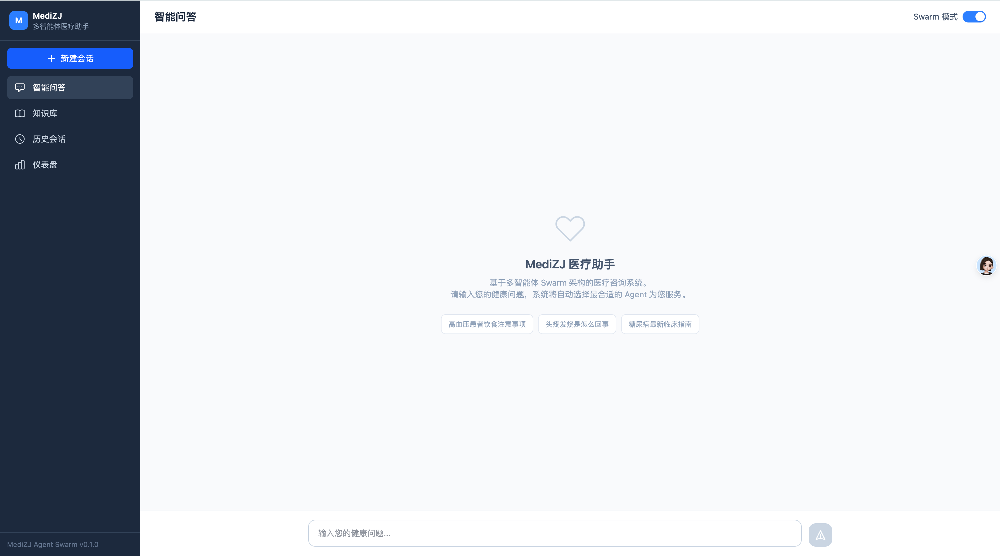

# MediZJ多智能体医疗助手

基于 Skill + Tool 双层架构的多智能体协作医疗助手系统，融合 Agent Loop、Agent Swarm、记忆管理、Milvus 知识库和 Web 前端界面。


## 📋 项目概述

本项目采用创新的 **Skill + Tool 双层架构**，通过10个原子 Skills（能力包：指令+工具）和3个专业 Agent 协同工作，提供智能、专业的医疗服务。支持 **CLI 交互**和 **Web 界面**两种使用方式。

### 🎯 核心特性

- **🌐 Web 前端界面**: Vue 3 + FastAPI 全栈架构，支持智能问答、知识库浏览、会话管理、仪表盘 ✅
- **📡 流式响应**: 实时推送 Agent 执行过程，可视化 Agent 参与情况 ✅
- **🩺 交互式问诊**: LeadAgent 在任务分发前通过结构化问卷收集用户背景信息（症状、病史、用药等），实现"先问后诊" ✅
- **🔧 Skill + Tool 双层架构**: 10个原子 Skills（指令+工具）与底层 Tool 调用明确分层，activate_skill 激活后注入指令并动态加载工具 ✅
- **🤖 Agent Loop**: LLM 驱动的 Skill 调用循环，Agent 自主规划、调用 Skills 并完成任务 ✅
- **🤖 统一 Agent 委派**: 单 Agent 与 Swarm 共用 `process_subtask()` 执行机制，Worker 隔离子会话、无历史上下文，路由由 LeadAgent 评估自动决定 ✅
- **🧠 记忆系统**: 短期记忆（写时增量压缩）+ 长期记忆（Mem0）+ 个人档案（本地 PERSONAL.md）+ **LLM 质量门控 + 信息分类存储** ✅
- **💾 Milvus 知识库**: 统一知识管理，语义检索，支持模糊查询（"血压高" → "高血压"）；Web 界面支持文档增删改查、文件上传、chunk 查看 ✅
- **⚡ Claude Code Skills**: 10个预定义技能，一键调用医疗助手 ✅
- **🏗️ Harness Engineering**: 约束驱动 + 熵管理，系统自动验证和优化，保证安全、简洁、高质量 ✅
- **📝 Prompt 集中管理**: 所有 prompt 统一存放在 `prompt/` 目录，基于 Jinja2 模板引擎管理，支持变量渲染和条件分支 ✅

## 🎯 Skill + Tool 双层架构

### 架构设计

```
两层模型：
  Skill    ── 能力包（name + description + instructions 指令正文 + 声明的 tools）
  Tool     ── 底层可调用函数，属于某个 Skill

启动时：
  所有 Skill 的 name + description 写入 system prompt（LLM 启动即知可用能力）
  base tools = [activate_skill]（仅需 1 个基础工具）

运行时：
  LLM 从 system prompt 知道有哪些 Skill
  → 调用 activate_skill("search-knowledge")
  → tool result 返回该 Skill 的 instructions 指令正文
  → tools 列表更新为该 Skill 声明的工具
  → LLM 使用 Skill 的工具执行任务
  → 给出最终回答
```

### 关键特性

1. **Skill 与 Tool 分层**
   - Skill 是能力包：包含描述、指令正文（SKILL.md body）、声明的工具列表
   - Tool 是底层函数：从 Skill 的 `script/` 目录加载，仅在 Skill 激活时可用
   - `activate_skill` 是唯一的基础工具，始终可用

2. **指令注入机制**
   - SKILL.md 的 YAML frontmatter 提供 `name`、`description`、`tools` 字段
   - SKILL.md 的 Markdown 正文作为 Skill 指令，通过 `activate_skill` 的 **tool result** 返回给 LLM
   - Agent 获得 Skill 的上下文知识，而非仅获得工具

3. **动态工具加载**
   - 未激活任何 Skill 时，LLM 只有 `activate_skill` 一个工具
   - 激活 Skill 后，该 Skill 声明的工具动态加载到工具列表
   - 激活新 Skill 自动停用前一个，避免工具膨胀

4. **兼容模式自动检测**
   - 全部 10 个 Skill 都有 `tools` 声明 → 启用双层模式
   - 否则 → 兼容模式（所有工具平铺暴露，旧行为）

5. **多轮对话支持**
   - 短期记忆：会话级对话历史（10条消息），**仅供 LeadAgent 使用**（任务分解时参考上下文）
   - **统一子会话隔离**：所有模式（单 Agent / Swarm / 降级）均通过 `process_subtask()` 执行 Worker，使用独立子会话 ID（`{session_id}:{agent_id}:{subtask_id}`），Worker 无历史上下文、只接收任务指令
   - 个人档案：`memory/profile/PERSONAL.md`，通过 AgentLoop 注入为 system message，所有 Agent 共享
   - 长期记忆：Mem0 跨会话记忆（经 LLM 质量门控过滤），LeadAgent 筛选后嵌入子任务 description
   - **上下文利用率 100%**：追问能正确理解历史对话（LeadAgent 持有历史，分解出引用上下文的子任务）
   - **LLM 语义摘要**：写入时增量压缩，早期对话自动压缩为结构化摘要，保留关键医学信息

### SKILL.md 格式

```yaml
---
name: search-knowledge
description: 搜索医学知识库，通过语义检索查找相关医疗信息
tools:
  - search_knowledge
---

# 搜索医学知识
[正文内容作为 Skill 指令，激活时注入 system prompt]
...
```

### 数据模型

```python
@dataclass
class SkillDefinition:
    name: str                    # "deep-research"
    description: str             # YAML frontmatter description
    instructions: str            # SKILL.md body 正文
    tool_names: List[str]        # YAML tools 列表
    tool_functions: Dict[str, Callable]  # 实际加载的函数对象
    migrated: bool               # 是否有 tools 声明
```


## 🩺 交互式问诊（question_for_user）

系统在将用户问题分发给 Worker Agent 之前，由 **LeadAgent 先执行信息澄清阶段**，通过结构化问卷收集用户背景信息，实现"先问后诊"。

### 工作流程

```
用户输入: "我最近头疼"
    │
    ▼
LeadAgent.clarify()
    │
    ├─ LLM 判断: 需要更多信息（症状细节、持续时间、病史等）
    │
    ├─ 调用 question_for_user 工具 → 构建 XML 问卷
    │
    ├─ 发射 AGENT_QUESTIONNAIRE 事件 → SSE 推送到前端
    │
    ├─ AgentLoop 暂停（await Future）←─ ─ ─ ─ ─ ─ ─ ┐
    │                                           │
    ▼                                           │
前端 QuestionnaireCard 渲染                       │
  ┌──────────────────────┐                        │
  │  年龄 | 性别 | 症状    │  ← Tab 切换式          │
  │ ┌──────────────────┐ │                        │
  │ │ 症状持续了多久？   │ │                        │
  │ │ ○ 不到1天         │ │                        │
  │ │ ● 1-3天          │ │                        │
  │ │ ○ 1周左右        │ │                        │
  │ │ 其他：[____]      │ │  ← 自由输入框           │
  │ └──────────────────┘ │                        │
  │    < 上一题  ●●○  下一题 >                       │
  └──────────────────────┘                        │
    │                                             │
    ├─ 用户填写并提交                               │
    │                                             │
    ├─ POST /api/chat/answer ──── resolve Future ─┘
    │
    ├─ AgentLoop 恢复，收集到的信息作为 tool_result
    │
    ▼
LeadAgent.assess_and_decompose(问题 + collected_info)
    │
    └─ 按子任务数量路由 → Worker 执行（统一走 process_subtask + 隔离子会话）
```

### 核心组件

| 组件 | 文件 | 职责 |
|------|------|------|
| **question_for_user 工具** | `core/tools/questionnaire.py` | XML 问卷解析 + 结构化数据构建 |
| **QuestionnaireManager** | `core/questionnaire_manager.py` | asyncio.Future 暂停/恢复管理 |
| **LeadAgent.clarify()** | `swarm/lead_agent.py` | LLM tool calling 收集信息 |
| **AGENT_QUESTIONNAIRE 事件** | `swarm/events.py` | 向前端推送问卷 |
| **QuestionnaireCard 组件** | `frontend/src/components/chat/QuestionnaireCard.vue` | Tab 切换式问卷 UI |
| **答案提交端点** | `api/routers/chat.py` | `POST /api/chat/answer` 接收用户回答 |

### XML 问卷格式

```xml
<questions>
  <question header="年龄" type="input" required="true">
    <text>请问您的年龄是？</text>
  </question>
  <question header="性别" type="enum" required="true">
    <text>您的性别是？</text>
    <suggest>男</suggest>
    <suggest>女</suggest>
  </question>
  <question header="既往病史" type="multi" required="false">
    <text>您是否有以下既往病史？</text>
    <suggest>高血压</suggest>
    <suggest>糖尿病</suggest>
    <suggest>心脏病</suggest>
  </question>
</questions>
```

**题型说明**：

| type | 渲染方式 | 说明 |
|------|---------|------|
| `enum` | 单选按钮 + 其他输入框 | 单选，用户也可在"其他"框自由输入 |
| `multi` | 复选框 + 其他输入框 | 多选，"其他"内容提交时追加到已选项 |
| `input` | 文本输入框 | 自由文本，如年龄、症状描述等 |

### 关键设计

1. **LeadAgent 统一收集**：澄清阶段仅在 LeadAgent 层面执行，Worker Agent 不再自行提问
2. **暂停/恢复机制**：基于 `asyncio.Future`，工具返回 `needs_user_input` 标记后 AgentLoop 自动 await，前端提交后 resolve 继续
3. **上下文注入**：clarify 和 assess 阶段自动注入用户档案（仅已确认信息）+ 近期对话 + 历史相似案例，避免重复提问已有信息
4. **Tab 切换 UI**：前端问卷不一次性展开，每次只显示一个问题，支持上/下一题切换和进度指示
5. **自由输入兜底**：单选/多选题底部均有"其他"输入框，避免选项遗漏用户实际情况
6. **最多 2 轮澄清**：LeadAgent 最多进行 2 轮问卷交互，避免无限循环


## 🚀 从零开始运行

### 1. 环境准备

```bash
conda create -n medix-swarm python=3.12 -y
conda activate medix-swarm
cd medix-agent-swarm
```

### 2. 安装依赖

```bash
pip install -r requirements.txt
```

### 3. 配置 API

复制 `.env.example` 并填入实际配置：

```bash
cp .env.example .env
```

编辑 `.env` 文件：

```env
# LLM 配置（OpenAI 兼容 API）
LLM_API_KEY=your-llm-api-key
LLM_BASE_URL=https://api.openai.com/v1
LLM_MODEL_NAME=your-model-name
LLM_TEMPERATURE=0.7
LLM_MAX_TOKENS=8192

# Mem0 长期记忆配置（可选）
MEM0_API_KEY=m0-your-api-key-here
```

### 4. 初始化知识库

```bash
python knowledge/scripts/import_hardcoded_data.py
```

### 5. 运行测试

```bash
python examples/test_all.py
```

### 6. 开始使用

**方式一：Web 界面（推荐）**

```bash
# 终端 1：启动后端 API 服务
uv run python api_main.py

# 终端 2：启动前端开发服务器
cd frontend && npm install && npm run dev

# 浏览器访问 http://localhost:5173
# API 文档：http://localhost:8000/docs
```

**方式二：CLI 交互**

```bash
python main.py
```

## 📦 项目结构

```
medix-agent-swarm/
├── api/                               # FastAPI 后端 API 层
│   ├── main.py                        # FastAPI 应用入口、CORS
│   ├── routers/
│   │   ├── chat.py                    # /api/chat 问答接口（含流式）
│   │   ├── knowledge.py               # /api/knowledge 知识库检索
│   │   ├── sessions.py                # /api/sessions 会话管理
│   │   ├── dashboard.py               # /api/dashboard 仪表盘 + 健康检查
│   │   └── personal.py                # /api/personal 个人健康档案
│   ├── models/                        # Pydantic 请求/响应模型
│   ├── services/                      # 业务逻辑封装
│   └── dependencies.py               # 依赖注入
│
├── frontend/                          # Vue 3 前端项目
│   ├── src/
│   │   ├── views/                     # 页面：ChatView, KnowledgeView, SessionsView, DashboardView, PersonalView, TraceView
│   │   ├── components/                # 组件：chat/, agents/, knowledge/, dashboard/, layout/, trace/
│   │   ├── stores/                    # Pinia 状态管理
│   │   ├── api/                       # API 调用层（chat, knowledge, sessions, dashboard, personal, trace）
│   │   ├── composables/               # useSSE (流式), useMarkdown
│   │   │   └── types/                     # TypeScript 类型定义
│   └── trace/                          # Trace 追踪模块
│       ├── context.py                  # Trace 上下文管理
│       ├── collector.py                # Span 收集器
│       ├── models.py                   # Trace 数据模型
│       └── storage.py                  # SQLite 持久化
│   ├── vite.config.ts
│   └── package.json
│
├── .claude/skills/                    # Claude Code Skills (10个)
│   ├── search-knowledge/              # 搜索医学知识库
│   ├── assess-risk/                   # 风险评估
│   ├── analyze-symptoms/              # 症状分析
│   ├── recommend-lifestyle/           # 生活方式建议
│   ├── disease-code/                  # ICD-10疾病编码
│   ├── clinical-guideline/            # 临床指南检索
│   ├── deep-research/                 # 深度研究
│   ├── search-history/                # 搜索会话历史（短期记忆）
│   ├── search-similar-cases/          # 搜索相似案例（长期记忆）
│   └── render-markdown-html/          # Markdown 与 HTML 互转
│
├── agents/                            # Agent 实现
│   ├── base_agent.py                  # Agent 基类
│   ├── consultation_agent.py          # 健康咨询 Agent
│   ├── diagnostic_agent.py            # 症状诊断 Agent
│   ├── research_agent.py              # 医学研究 Agent
│   └── skill_registry_mixin.py        # Skill 注册混入
│
├── core/                              # 核心引擎
│   ├── agent_loop.py                  # Agent Loop（集成约束验证，动态工具刷新，用户档案注入，问卷暂停/恢复）
│   ├── llm_client.py                  # LLM 客户端
│   ├── prompt_loader.py               # Jinja2 Prompt 模板加载器
│   ├── skill_loader.py                # 动态加载 Skills（支持多函数加载、指令提取）
│   ├── skill_registry.py              # Skill 注册表（双层注册、compat_mode 自动检测）
│   ├── skill_models.py                # SkillDefinition 数据模型
│   ├── questionnaire_manager.py       # 问卷 Future 暂停/恢复管理器
│   ├── tools/                         # 统一基础工具目录
│   │   ├── __init__.py                # 统一导出
│   │   ├── activate_skill.py          # activate_skill 工具工厂
│   │   └── questionnaire.py           # question_for_user 工具（XML 解析 + 格式化）
│   └── state_manager.py               # 状态管理
│
├── prompt/                            # Prompt 模板（Jinja2，集中管理）
│   ├── agents/                        # Agent 系统提示词
│   │   ├── consultation_system.j2
│   │   ├── consultation_user_input.j2
│   │   ├── diagnostic_system.j2
│   │   └── research_system.j2
│   ├── swarm/                         # Swarm 协调相关提示词
│   │   ├── lead_system.j2
│   │   ├── lead_clarify.j2            # LeadAgent 澄清阶段系统提示词
│   │   ├── lead_clarify_user.j2       # LeadAgent 澄清阶段用户提示词
│   │   ├── synthesis.j2
│   │   ├── assessment_user.j2
│   │   └── timeout_fallback.j2
│   ├── research/                      # 研究模块提示词
│   │   ├── evidence_synthesis.j2
│   │   └── query_planning.j2
│   ├── memory/                        # 记忆相关提示词
│   │   ├── compression_system.j2
│   │   ├── compression_user.j2
│   │   └── quality_eval.j2            # 质量评估 + 信息分类
│   ├── agent_loop/                    # Agent Loop 控制消息
│   │   ├── tool_limit.j2
│   │   └── force_answer.j2
│   └── validation/                    # 输出验证模板
│       ├── disclaimer.j2
│       ├── high_risk_warning.j2
│       ├── truncation_notice.j2
│       └── swarm_disclaimer.j2
│
├── swarm/                             # Swarm 协调器
│   ├── events.py                      # 事件驱动通信（含 AGENT_QUESTIONNAIRE）
│   ├── lead_agent.py                  # 信息澄清 + 任务分解 + 结果汇总
│   ├── shared_context.py              # 共享环境（信息素）
│   └── swarm_coordinator.py           # 智能路由（clarify → decompose → route）
│
├── memory/                            # 记忆管理（集成熵管理）
│   ├── long_term.py                   # 长期记忆（Mem0）
│   ├── short_term.py                  # 短期记忆（单例，写时增量压缩 + 子会话隔离）
│   ├── personal_profile.py            # 个人健康档案（memory/profile/）
│   ├── session_summary.py             # 会话总结
│   ├── entropy_manager.py             # 熵管理器（向量语义去重 + LLM 摘要 + 截断降级）
│   └── embedding.py                   # 共享 embedding 工具（模型加载 + 余弦相似度）
│
├── constraints/                       # 约束系统
│   ├── agent_constraints.yaml         # Agent 能力边界
│   ├── swarm_constraints.yaml         # Swarm 协作规则
│   └── validator.py                   # 约束验证器
│
├── validation/                        # 输出验证和修复
│   └── auto_fixer.py                  # 自动修复器
│
├── knowledge/                         # Milvus 知识库
│   ├── milvus_kb.py                   # 知识库封装（CRUD + 语义搜索）
│   ├── data/documents/                # 医学知识文档
│   └── scripts/
│       ├── import_hardcoded_data.py   # 批量导入文档
│       └── deduplicate.py             # 数据去重脚本
│
├── research/                          # DeepResearch 模块
│   ├── deep_research_workflow.py
│   ├── evidence_synthesizer.py
│   └── web_search.py
│
├── examples/
│   └── test_all.py                    # 测试套件
│
├── main.py                            # CLI 入口
├── api_main.py                        # Web 服务入口（uvicorn）
├── pyproject.toml                     # 项目配置和依赖
└── .env                               # 环境变量配置
```

**架构说明**：
- ✅ **Web + CLI 双入口**：`api_main.py`（Web）/ `main.py`（CLI）
- ✅ **统一配置**：使用项目根目录 `.env` 文件管理环境变量
- ✅ **统一 Agent 委派**：单 Agent / Swarm / 降级均走 `process_subtask()` + 子会话隔离，路由自动决定

## 🤖 Skills 和 Agent 清单

### 10个原子 Skills（两层架构）

**所有 Agent 共享以下 Skills**：

| Skill | 功能 | 数据源 | 特点 |
|-------|------|--------|------|
| `search_knowledge` | 搜索医学知识库 | Milvus | 语义检索 |
| `recommend_lifestyle` | 生活方式和用药建议 | Milvus | 个性化建议 |
| `assess_risk` | 风险等级评估 | 规则引擎 | 高危症状识别 |
| `analyze_symptoms` | 症状模式分析 | 规则引擎 | 多系统分析 |
| `disease_code` | ICD-10疾病编码 | Milvus | 标准编码 |
| `clinical_guideline` | 临床指南检索 | Milvus | 权威指南 |
| `deep_research` | 深度研究 | 网络搜索 | 最新进展 |
| `search_history` | 搜索会话历史 | 短期记忆 | 当前会话上下文 |
| `search_similar_cases` | 搜索相似案例 | 长期记忆 | 跨会话经验 |

### 3个专业 Agent（自主选择 Skills）

#### 1. ConsultationAgent（健康咨询）
- **能力**: 通用健康咨询和生活方式指导
- **注册 Skills**: 全部10个（自主选择合适的 Skills）
- **常用 Skills**: `search_knowledge`, `recommend_lifestyle`

#### 2. DiagnosticAgent（症状诊断）
- **能力**: 症状分析、风险评估和鉴别诊断
- **注册 Skills**: 全部10个（自主选择合适的 Skills）
- **常用 Skills**: `assess_risk`, `analyze_symptoms`, `disease_code`

#### 3. ResearchAgent（医学研究）
- **能力**: 循证医学证据和权威指南检索
- **注册 Skills**: 全部10个（自主选择合适的 Skills）
- **常用 Skills**: `clinical_guideline`, `deep_research`

### 2个协调 Agent

- **LeadAgent**: 信息澄清 + 任务分解 + 结果汇总（独占历史上下文）
- **SwarmCoordinator**: 记忆检索 + 路由分发 + 子会话合并（路由由 LeadAgent 评估自动决定）

## 🌐 Web 界面

系统提供基于 Vue 3 + FastAPI 的 Web 界面，支持以下功能模块：

| 页面 | 功能 | 路由 |
|------|------|------|
| **智能问答** | 聊天式问答，实时展示 Agent 协作过程，Markdown 渲染 | `/chat` |
| **知识库** | 医学知识语义搜索、文档管理（增删改查）、文件上传、chunk 查看 | `/knowledge` |
| **历史会话** | 会话列表查看、恢复、删除 | `/sessions` |
| **仪表盘** | 统计概览、Agent 使用分布、最近会话 | `/dashboard` |
| **个人中心** | 查看/编辑个人健康档案（年龄、性别、病史等） | `/personal` |
| **Trace 追踪** | 请求追踪、Agent 耗时分析、LLM 调用详情、工具调用统计 | `/trace` |

### Web 架构

```
浏览器 (Vue 3 + Vite + Tailwind CSS)
   ↓ fetch + ReadableStream
Vite Dev Proxy (/api → localhost:8000)
   ↓
FastAPI (api_main.py)
   ↓
api/routers/chat.py → api/services/chat_service.py
   ↓ EventBridge (asyncio.Queue)
SwarmCoordinator.process()
   ↓
SharedContext.on_event_callback → 事件推送
   ↓
换行分隔 JSON 流式响应 → 前端实时渲染
```

### API 端点

| 方法 | 路径 | 功能 |
|------|------|------|
| POST | `/api/chat` | 非流式问答 |
| POST | `/api/chat/stream` | 流式问答（换行分隔 JSON） |
| POST | `/api/chat/answer` | 提交问卷答案（交互式问诊） |
| GET | `/api/chat/history/{session_id}` | 获取会话历史 |
| POST | `/api/knowledge/search` | 知识库搜索（去重，返回完整文档） |
| GET | `/api/knowledge/types` | 知识库类型列表 |
| GET | `/api/knowledge/documents` | 文档列表 |
| GET | `/api/knowledge/documents/{doc_id}/chunks` | 查看文档分块 |
| DELETE | `/api/knowledge/documents/{doc_id}` | 删除文档 |
| POST | `/api/knowledge/upload` | 上传文件（.txt） |
| PUT | `/api/knowledge/documents/{doc_id}` | 更新文档内容 |
| GET | `/api/sessions` | 会话列表 |
| GET | `/api/sessions/{session_id}` | 会话详情 |
| DELETE | `/api/sessions/{session_id}` | 删除会话 |
| GET | `/api/dashboard/stats` | 仪表盘统计 |
| GET | `/api/personal` | 获取个人健康档案 |
| PUT | `/api/personal` | 更新个人健康档案 |
| GET | `/api/health` | 健康检查 |
| GET | `/api/traces` | Trace 列表 |
| GET | `/api/traces/{trace_id}` | Trace 详情 |
| GET | `/api/traces/{trace_id}/spans` | Trace Span 列表 |
| GET | `/api/traces/{trace_id}/waterfall` | 瀑布图数据 |
| GET | `/api/traces/stats/agents` | Agent 耗时统计 |
| GET | `/api/traces/stats/tools` | 工具调用统计 |
| GET | `/api/traces/stats/llm` | LLM 调用统计 |
| GET | `/api/traces/stats/slow` | 慢请求列表 |
| GET | `/api/traces/stats/errors` | 错误统计 |


## ⚙️ 配置说明

项目使用 `.env` 文件管理配置（基于 `python-dotenv`）。

### 配置内容

```env
# LLM 配置（OpenAI 兼容 API）
LLM_API_KEY=your-llm-api-key
LLM_BASE_URL=https://ark.cn-beijing.volces.com/api/v3
LLM_MODEL_NAME=your-model
LLM_TEMPERATURE=0.7
LLM_MAX_TOKENS=8192

# Mem0 长期记忆配置（可选，获取地址：https://app.mem0.ai）
MEM0_API_KEY=m0-your-api-key-here
```

### 记忆系统配置

本系统支持三层记忆机制：**短期记忆（会话级）**、**个人档案（本地持久化）** 和 **长期记忆（Mem0 跨会话）**，通过 LLM 质量门控实现信息分类存储。

#### 短期记忆（ShortTermMemory）

**作用**：存储当前会话的对话历史，支持多轮对话上下文理解。

**配置**：
```python
# 方式1: 内存存储（默认，无需配置）
from memory.short_term import ShortTermMemory
memory = ShortTermMemory(storage_type="memory")

# 方式2: Redis持久化（可选）
memory = ShortTermMemory(storage_type="redis", redis_config={"host": "localhost", "port": 6379})
```

**存储方式**：
- **内存**（默认）：无需配置，保留时间60分钟
- **Redis**（可选）：通过 `redis_config` 参数传入配置，支持持久化
- 存储容量：累积消息，写入时熵驱动压缩

**智能压缩（写时增量压缩）**：

短期记忆采用"写入时压缩、读取时零开销"模式。每次 `add_message()` 写入新消息后，检查未压缩消息的熵等级，仅当满足高熵条件时触发压缩：

- **熵驱动触发**：未压缩消息满足 `total_messages > 20` 或 `duplicate_rate > 0.15` 或 `avg_message_length > 500` 时才压缩，否则跳过
- **增量压缩**：只压缩较旧的消息，保留最近 N 条不动；压缩摘要持久化到 messages 列表，下次读取直接返回
- **LLM 语义摘要**（推荐）：调用 LLM 将早期对话压缩为结构化摘要，保留关键医学信息
- **截断降级**（自动）：LLM 不可用时降级为截断模式
- **去重**：基于向量语义相似度（BAAI/bge-small-zh-v1.5）检测并移除重复消息，阈值 0.9

#### 个人档案（PersonalProfile）

**作用**：持久化患者个人信息（年龄、性别、病史、过敏史等），全局单文件。

**存储路径**：`memory/profile/PERSONAL.md`

**工作方式**：
- LLM 每轮对话自动提取个人信息，增量合并写入
- 对话开始时自动注入到 Agent 上下文（仅已确认信息，来自 `PERSONAL.md`）
- 前端「个人中心」支持手动查看和编辑

**文件格式**：
```markdown
# 患者个人信息

- 年龄：28岁
- 性别：男性
- 过敏史：青霉素过敏
```

#### 长期记忆（Mem0）

**作用**：跨会话记忆，存储可复用的医学知识和事实。

**配置**：
```env
MEM0_API_KEY=m0-your-api-key-here  # 获取地址：https://app.mem0.ai
```

**存储方式**：
- **Mem0 云服务**：自动处理向量化和相似度搜索
- 存储范围：跨会话持久化
- 存储内容：可复用的医学事实（症状关联、治疗方案、风险评估等）

#### LLM 质量门控 + 信息分类存储

每轮对话结束后，系统调用 LLM 对对话内容进行评估和分类：

```
对话完成
  ↓
LLM 评估（prompt/memory/quality_eval.j2）
  ├─ 质量评分（1-10）
  ├─ 提取个人信息 → memory/profile/PERSONAL.md
  └─ 提取可复用事实 → Mem0
```

**评分规则**：
- score < 5：跳过 Mem0 存储（低质量闲聊等），但个人信息仍会保存
- score ≥ 5：个人信息 + 可复用事实均入库

**日志输出**（每个 turn）：
```
  [Personal] 年龄：28岁
  [Mem0] [症状与疾病的关联] 前额胀痛是紧张性头痛的典型表现
Memory gate: PASS score=9 facts=5 personal=1 session=xxx
Memory turn summary — short_term=5 msgs | personal=1 items saved | mem0=PASS
```

#### 记忆系统如何融入对话

**流程**：

```
1. 会话开始
   ↓
2. 短期记忆：直接返回当前会话历史（压缩已在写入时完成，读取零开销）→ 仅供 LeadAgent 参考
   ↓
3. 长期记忆：检索 Mem0 相似案例
   ↓
4. LeadAgent 任务分解（携带已确认档案 + 短期记忆 + 长期记忆）
   - 用户档案（`to_text()`，仅已确认信息）→ clarify + assess 阶段自动注入
   - 短期记忆 → 理解多轮对话意图
   - 长期记忆 → 基于历史案例做更好的任务分配
   - 相关记忆嵌入子任务 description → 传递给 Worker
   ↓
5. Worker Agent 执行（统一子会话隔离）
   - 所有模式（单 Agent / Swarm / 降级）均走 process_subtask()
   - 每个 Worker 使用独立子会话 ID（`{session_id}:{agent_id}:{subtask_id}`），历史互不干扰
   - Worker 不加载短期记忆，只接收任务指令和用户档案
   - 个人档案：通过 AgentLoop 自动注入为 system message（所有 Agent 共享）
   - 执行完毕后：最终回答合并回主会话，子会话清除
   ↓
6. 对话结束 → LLM 质量评估 + 信息分类
   ├─ 个人信息 → PERSONAL.md
   ├─ 可复用事实 → Mem0
   └─ 短期记忆 → Agent Loop 中自动保存
```

**注意事项**：

- 未设置 `MEM0_API_KEY` 时，系统会优雅降级，仅使用短期记忆和个人档案
- 短期记忆默认使用内存存储，无需配置 Redis
- 个人档案始终可用（本地文件，无外部依赖）

## 🏗️ Harness Engineering 融合

**核心理念**："人类设计约束，AI 代理执行" —— 让 AI 在明确约束下自主工作、自我修正。

### 实现的 Harness 原则

| 原则 | MediZJ 实现 | 位置 |
|------|-----------|------|
| **约束驱动** | YAML 定义 Agent 能力边界，运行时验证 Skill 调用和输出 | `constraints/` |
| **自动修复** | 缺少免责声明自动添加，高危症状自动提醒就医 | `validation/` |
| **熵管理** | 记忆自动去重和压缩，防止系统膨胀（详见下方） | `memory/entropy_manager.py` |

### 熵管理全流程

熵管理器是系统的"垃圾回收器"，借鉴信息论中"熵"的概念，自动清理和压缩会话历史中的冗余信息，让 LLM 始终聚焦于有效内容。

#### 设计原则

- **写时增量压缩，读时直接返回**：消息写入时检查熵，满足高熵条件时压缩早期对话，压缩结果持久化到 messages 列表；读取时直接返回列表尾部，零计算开销
- **累积增长**：压缩后继续累积新消息，当新的未压缩部分再次满足高熵条件时再次压缩
- **熵驱动**：先评估信息熵，低熵时零开销跳过，高熵时按需执行去重和压缩
- **自动降级**：LLM 不可用时自动切换为截断模式，嵌入模型加载失败时直接返回原始消息

#### 增量压缩流程

`_maybe_compress_incremental()` 在每次 `add_message()` 后自动调用：

```
输入: 新消息写入 messages[]
  │
  ▼
Step 1: 提取未压缩部分        messages[_uncompressed_start:]
  │
  ▼
Step 2: 分离可压缩区间         [start, len - keep_recent) 保留最近 N 条不动
  │
  ▼
Step 3: estimate_entropy()    计算可压缩区间的多维熵指标
  │
  ├── entropy_level != "high" → 跳过（零开销）
  │
  ▼
Step 4: duplicate_rate > 0.1? → deduplicate_messages() 贪心语义去重
  │
  ▼
Step 5: _compress_older_messages()
  │     ├── LLM 语义摘要（含动态熵约束）
  │     └── 截断降级（LLM 不可用时）
  │
  ▼
Step 6: 替换原区间 + 更新 _uncompressed_start 指针
```

#### 熵评估（多指标判定）

| 指标 | 计算方式 | 高熵阈值 |
|------|----------|----------|
| `total_messages` | 消息总数 | > 20 |
| `duplicate_rate` | 两两余弦相似度 > 0.9 的对数 / 总对数 | > 15% |
| `avg_message_length` | 平均字符数 | > 500 |

**判定规则**：任一指标触发即标记为 `entropy_level = "high"`。

`duplicate_rate` 计算示例：5 条消息共有 `5×4/2 = 10` 对组合，其中 2 对的余弦相似度 > 0.9，则 `duplicate_rate = 2/10 = 20%`。

#### 语义去重

基于 `BAAI/bge-small-zh-v1.5` 嵌入模型（512 维中文向量），采用贪心策略：

- 从新到旧逐条比对，与已保留条目的余弦相似度 > 0.9 则标记为重复
- 语义相同但措辞不同的消息也能被识别（如"高血压怎么办"与"得了高血压该怎么处理"）

#### LLM 语义压缩

当 `llm_client` 可用时，调用 LLM 将早期对话压缩为 200 字以内的结构化摘要。关键设计：**熵指标驱动动态约束注入**——

| 熵特征 | 注入的 LLM 约束 |
|--------|----------------|
| `duplicate_rate > 20%` | "对话中存在大量重复内容，请高度去重，相似问题只保留一个" |
| `avg_message_length > 500` | "单条消息较长，请重点提炼核心信息" |
| `total_messages > 30` | "对话轮次较多，请高度概括，聚焦最后的关键结论" |

LLM 的 `max_tokens` 也受熵等级影响：高熵 512 tokens，普通 256 tokens。

LLM 不可用或调用失败时，自动降级为截断模式：将 user + assistant 配对，截取前 50/100 字符生成摘要。

压缩摘要以 `assistant` role 存储，兼容 `get_history()` 的消息过滤逻辑，确保 Agent 能正确接收早期对话的摘要信息。

#### 集成位置

| 集成点 | 位置 | 作用 |
|--------|------|------|
| **ShortTermMemory.add_message()** | `memory/short_term.py` | 写入时调用 `_maybe_compress_incremental()`，熵驱动增量压缩 |
| **ShortTermMemory.get_recent_messages()** | `memory/short_term.py` | 读取时直接返回 messages 列表，零压缩开销 |
| **LongTermMemory** | `memory/long_term.py` | 轻量使用：在 `search_similar_sessions()` 中仅调用 `deduplicate_sessions()`，无 LLM 客户端 |
| **SwarmCoordinator** | `swarm/swarm_coordinator.py` | 传入 LLM 客户端，使短期记忆具备 LLM 压缩能力 |

核心流程：

```
AgentLoop.run()
  → ShortTermMemory.add_message(session_id, "user", content)
    → messages.append(new_message)
    → _maybe_compress_incremental(history)
      → 熵检查 → 去重 + 压缩 → 更新 _uncompressed_start

  → ShortTermMemory.get_history(session_id, limit=5)
    → messages[-limit:]  # 直接返回，无压缩计算
```

### 验证

运行完整测试套件（包含 Harness 测试）：
```bash
python examples/test_all.py
```

## 📊 评估框架

端到端评估框架，验证 5 项核心指标是否达标。

### 评估指标

| 指标 | 目标 | 评估方法 |
|------|------|----------|
| 智能路由准确率 | ≥ 95% | 50 题标注数据集，多次运行多数投票，比对模式 + Agent 分配 |
| 知识库检索准确率 | ≥ 87% | 30 查询数据集，Precision@5 / Recall@5 / MRR / Hit Rate |
| 响应时间 | 单 Agent ≤15s, Swarm ≤30s | P50/P90/P95 统计 + 超时率 |
| 多轮对话上下文理解 | ≥ 92% | 20 组对话 68 轮，关键词命中 + LLM-as-Judge 评分 |
| 整体回答质量 | 系统 4.5 vs Baseline 3.9 | 30 题 AB 盲评，三维度（准确性/完整性/安全性）评分 |

### 运行评估

```bash
# 运行全部评估
python -m eval.runner --metrics all

# 单指标
python -m eval.runner --metrics routing
python -m eval.runner --metrics retrieval
python -m eval.runner --metrics latency
python -m eval.runner --metrics multiturn
python -m eval.runner --metrics abtest

# 多指标
python -m eval.runner --metrics routing,retrieval

# AB 测试评分计算（需要先填写 scores 字段）
python -m eval.runner --score-abtest
```

### 评估报告

运行后自动生成：
- `eval/reports/eval_report_{timestamp}.md` — Markdown 评估报告
- `eval/reports/eval_result_{timestamp}.json` — JSON 结构化结果
- `eval/reports/abtest_blind_review.json` — AB 盲评数据（待人工评分）

---

## 📝 Prompt 集中管理

所有 LLM prompt 统一存放在 `prompt/` 目录下，使用 Jinja2 模板引擎管理，实现 prompt 与代码解耦。

### 动态”卡带式” System Prompt

系统提示词采用 KV cache 友好的三层结构（基础角色 + 技能目录 → 用户档案 → Skill 指令通过 tool result 返回）。system prompt 前缀在 Agent Loop 中保持稳定，Skill 指令不修改 system prompt，而是通过 `activate_skill` 的工具返回值传递给 LLM。Swarm 层面，LeadAgent 与 Worker 的 Prompt 体系完全解耦。

### 设计理念

- **集中管理**: 21 个 `.j2` 模板文件按功能分 6 个子文件夹，所有 prompt 一目了然
- **Jinja2 模板**: 支持变量渲染（`{{ variable }}`）、条件分支（``）、循环（``）
- **代码解耦**: Python 代码不再包含 prompt 字符串，修改 prompt 无需改动业务逻辑
- **统一入口**: `PromptLoader` 类提供 `load()`（静态）和 `render()`（带变量）两个方法

### 模板目录结构

```
prompt/
├── agents/                # Agent 系统提示词（4 个）
├── swarm/                 # Swarm 协调提示词（6 个）
├── research/              # 研究模块提示词（2 个）
├── memory/                # 记忆相关提示词（3 个）
├── agent_loop/            # Agent Loop 控制消息（2 个）
└── validation/            # 输出验证模板（4 个）
```

### 使用方式

```python
from core.prompt_loader import PromptLoader

# 加载静态模板（无变量）
system_prompt = PromptLoader.load("agents/consultation_system.j2")

# 渲染带变量的模板
user_msg = PromptLoader.render(
    "swarm/assessment_user.j2",
    question="高血压怎么办？",
    personal_profile="个人信息：\n年龄：35岁",
    recent_history=[{"role": "user", "content": "..."}],
    historical_cases=[{"summary": "...", "score": 0.95}]
)

# 带条件分支的模板
disclaimer = PromptLoader.render(
    "validation/swarm_disclaimer.j2",
    timeout_occurred=True,
    completed_agents_count=1
)
```

### 模板变量说明

| 模板 | 变量 | 说明 |
| --- | --- | --- |
| `agents/consultation_user_input.j2` | `question`, `session_id`, `context` | 用户输入格式化 |
| `swarm/synthesis.j2` | `question`, `contributions_text`, `timeout_note`, `timeout_occurred` | 多 Agent 结果综合 |
| `swarm/assessment_user.j2` | `question`, `personal_profile`, `collected_info`, `recent_history`, `historical_cases` | LeadAgent 任务评估（结构化分段） |
| `research/evidence_synthesis.j2` | `query`, `web_results`, `kb_results` | 证据综合（含 for 循环） |
| `research/query_planning.j2` | `question` | 查询拆解 |
| `memory/compression_user.j2` | `dialogue_text` | 对话压缩 |
| `memory/quality_eval.j2` | `existing_personal`, `existing_facts`, `current_question`, `current_answer` | 质量评分 + 信息分类提取 |
| `agent_loop/tool_limit.j2` | `max_tool_calls` | 工具调用上限 |
| `validation/swarm_disclaimer.j2` | `timeout_occurred`, `completed_agents_count` | Swarm 免责声明 |

---

## 📚 统一知识库

- **向量数据库**: Milvus Lite（本地文件，无需服务器）
- **Embedding 模型**: BAAI/bge-small-zh-v1.5（中文，512维）
- **数据存储**: `knowledge/data/documents/` (txt 文档)
- **初始化**: `python knowledge/scripts/import_hardcoded_data.py`

### 知识库管理功能

Web 界面的知识库页面提供三个 Tab：

- **搜索**: 语义搜索，按 `doc_id` 去重，返回完整文档内容
- **文档管理**: 查看所有文档列表、每个文档的 chunk 详情、编辑和删除文档
- **上传文件**: 拖拽上传 `.txt` 文件，选择文档类型和元数据

### 数据去重

如因多次导入导致数据重复，运行去重脚本：

```bash
python knowledge/scripts/deduplicate.py
```


## 🤝 技术架构

### Agent Loop (Think-Act-Observe)

```
┌─────────┐     ┌────────┐     ┌──────────┐
│  Think  │ ──> │  Act   │ ──> │  Observe │
└─────────┘     └────────┘     └──────────┘
     ↑                               │
     └───────────────────────────────┘
```

### Skill + Tool 双层架构流程

```
启动时：
  所有 Skill 的 name + description → system prompt（LLM 启动即知可用能力）
  base tools = [activate_skill]

运行时（KV cache 友好，system prompt 前缀不变）：
用户问题
   ↓
SwarmCoordinator
   ├─ 检索长短期记忆，构建增强上下文
   │
   ├─ LeadAgent.clarify()  ← 信息澄清：注入用户档案+对话历史，避免重复提问
   │
   ├─ LeadAgent.assess_and_decompose(问题 + collected_info)  ← 注入完整上下文后分解
   │
   ├─ 按子任务数量路由（统一走 process_subtask + 隔离子会话）：
   │    ├─ 0个 → 降级到 ConsultationAgent
   │    ├─ 1个 → 直接路由到指定 Worker
   │    └─ ≥2个 → SharedContext 分发，3个 Worker 并行认领执行
   │
   └─ LeadAgent.synthesize_results() ← 汇总结果 → 最终回答
```

### 记忆系统架构

```
┌────────────────────────────────────┐
│  短期记忆（会话级，内存/Redis）     │
│  - 对话历史（messages）            │
│  - 写时增量压缩（熵驱动）          │
│  - 保留时间：60分钟                │
│  存储：内存（默认）或 Redis        │
├────────────────────────────────────┤
│  熵管理器（写时触发）              │
│  - 向量语义去重（检测重复消息）    │
│  - LLM 语义摘要（压缩早期对话）    │
│  - 截断降级（LLM 不可用时）        │
│  → 压缩结果持久化到 messages 列表  │
└────────────────────────────────────┘
           ↕ (每轮对话后)
┌────────────────────────────────────┐
│  LLM 质量评估 + 信息分类           │
│  - 质量评分（1-10）                │
│  - 信息提取与分类                  │
│  - 去重（已有事实跳过）            │
└──────┬─────────────┬───────────────┘
       │             │
       ▼             ▼
┌─────────────┐ ┌────────────────────┐
│ 个人档案    │ │ 长期记忆（Mem0）   │
│ PERSONAL.md │ │ 可复用医学事实     │
│ （本地文件）│ │ （向量数据库）     │
│ 年龄/性别/  │ │ 症状关联/治疗方案/ │
│ 病史/过敏史 │ │ 风险评估/生活建议  │
└──────┬──────┘ └─────────┬──────────┘
       │                  │
       ▼                  ▼
┌──────────────┐  ┌───────────────────┐
│ AgentLoop    │  │ LeadAgent         │
│ 注入为       │  │ 筛选相关案例      │
│ system msg   │  │ 嵌入 description  │
│ (所有Agent)  │  │ (传给 Worker)     │
│ 仅已确认信息 │  │ 仅已确认信息      │
└──────────────┘  └───────────────────┘
```
---
## 工作流

系统只有**一个统一工作流**，单 Agent 与 Swarm 的区别仅在于 LeadAgent 分解出的子任务数量不同——Worker 内部走完全相同的 `AgentLoop` 和 `process_subtask()` 子会话隔离机制。

### 统一工作流（路由决定并发度）

```plaintext
=======================================================================
        【 统一工作流：clarify → decompose → route → synthesize 】
=======================================================================

               [ 用户原始输入 (User Input) ]
                            │
                            ▼
┌─────────────────────────────────────────────────────────────────────────┐
│ 阶段 0：记忆检索 (SwarmCoordinator)                                     │
│ 统一检索三层记忆，构建增强上下文：                                       │
│   - 短期记忆：当前会话最近 10 条消息                                     │
│   - 长期记忆：Mem0 相似历史案例（最多 3 条）                             │
│   - 个人档案：PERSONAL.md（仅已确认信息）                                │
└─────────────────────────────────────────────────────────────────────────┘
                            │
                            ▼
┌─────────────────────────────────────────────────────────────────────────┐
│ 阶段 1：信息澄清 (LeadAgent.clarify)                                    │
│ Prompt: lead_clarify.j2 + lead_clarify_user.j2                          │
│ 注入: 用户档案 + 近期对话 + 历史相似案例                                │
│ LLM 主动调用 question_for_user 工具，向前端抛出问卷事件。               │
│ 收集完毕后，将用户填写的背景数据打包成 collected_info                   │
└─────────────────────────────────────────────────────────────────────────┘
                            │
                            ▼ (携带 collected_info)
┌─────────────────────────────────────────────────────────────────────────┐
│ 阶段 2：评估与分解 (LeadAgent.assess_and_decompose)                     │
│ Prompt: lead_system.j2 + assessment_user.j2                             │
│ LLM 分析问题复杂度，输出 SubTask 列表，每个子任务指定 assigned_agent    │
└─────────────────────────────────────────────────────────────────────────┘
                            │
                            ▼
              [ 按子任务数量智能路由 ]
                            │
          ┌─────────────────┼─────────────────┐
          ▼                 ▼                 ▼
   0 个子任务         1 个子任务         ≥2 个子任务
   ┌─────────┐      ┌──────────┐      ┌──────────────┐
   │ 降级到   │      │ 单 Agent │      │  Swarm 模式  │
   │ Consult  │      │ 直接路由 │      │ 并行协作     │
   │ Agent    │      │ 到指定   │      │              │
   │          │      │ Worker   │      │              │
   └────┬─────┘      └────┬─────┘      └──────┬───────┘
        │                 │                   │
        ▼                 ▼                   ▼
   process_subtask   process_subtask    ┌─────────────────────┐
   (隔离子会话)      (隔离子会话)       │ SharedContext 分发   │
        │                 │             │ 并行 process_subtask│
        │                 │             │ (隔离子会话)        │
        │                 │             └──────────┬──────────┘
        │                 │                        │
        └─────────────────┴────────────────────────┘
                            │
                            ▼
┌─────────────────────────────────────────────────────────────────────────┐
│ 阶段 3：结果汇总 (LeadAgent.synthesize_results)                         │
│ Prompt: synthesis.j2                                                    │
│ 将各 Worker 的 Contributions 拼接为 Markdown，连同原始问题交给 LLM      │
│ 超时时也会用已完成的部分结果尝试合成                                    │
└─────────────────────────────────────────────────────────────────────────┘
                            │
                            ▼
                   [ 生成最终回答 ]
                            │
                            ▼
┌─────────────────────────────────────────────────────────────────────────┐
│ 收尾 (SwarmCoordinator)                                                 │
│   - 子会话合并回主会话（Worker 历史隔离 → 主会话完整 Q&A 链）           │
│   - SessionSummary 持久化（含性能指标）                                 │
│   - LLM 质量门控 → 个人信息/病史进暂存区，高质量事实入 Mem0             │
│   - Trace 数据持久化                                                    │
└─────────────────────────────────────────────────────────────────────────┘
```

### Agent Loop 内部机制（所有 Worker 共享）

```plaintext
=======================================================================
        【 Agent Loop：Prompt 拼接与循环机制（KV cache 友好）】
=======================================================================

[ 每次迭代开始：初始化 Messages (AgentLoop._initialize_messages) ]
      │
      ▼
┌──────────────────────── Role: System (KV cache 稳定前缀) ─────────────────┐
│  1. 基础设定 (Base Prompt) : Agent 子类定义的核心角色和职责               │
│  2. 技能目录 (Skills Catalog): 当前 Agent 注册的所有可用 Skills 列表      │
│     ↑ 此后永不修改，KV cache 100% 命中                                    │
└───────────────────────────────────────────────────────────────────────────┘
      │
      ▼
┌───────────────────────── Role: System (缓慢变化) ────────────────────────┐
│  3. 用户档案 (User Context): ## 用户档案 (包含用户的长期画像数据)        │
│     ↑ 同一用户不变，KV cache 高命中                                      │
└──────────────────────────────────────────────────────────────────────────┘
      │
      ▼
┌───────────────────────── Role: User (动态) ─────────────────────────────┐
│  4. 当前输入 (User Input): 用户本次提问或派发的子任务内容               │
│     （Worker 通过 process_subtask() 执行，隔离子会话，无历史上下文）    │
└─────────────────────────────────────────────────────────────────────────┘
      │
      ▼
(( Agent 状态循环引擎开始 - State: IN_PROGRESS )) <─────────────────────────┐
      │                                                                     │
      ▼                                                                     │
 [ 调用 LLM Client ] ─────────────┐                                         │
      │                           │                                         │
      ▼ (无工具调用)              ▼ (返回 Tool Calls)                       │
[ 生成最终内容 Content ]    [ 记录 Assistant 消息 (含 tool_calls) ]         │
      │                           │                                         │
      │                           ▼                                         │
      │                     [ 循环执行工具 (execute_tool) ]                 │
      │                           │                                         │
      │                           ├─► 若工具为 `activate_skill`:            │
      │                           │   tool result 返回 Skill 指令正文,      │
      │                           │   tools 列表动态刷新（system prompt 不变）
      │                           │                                         │
      │                           ├─► 增加 Tool Call 计数，防止无限死循环   │
      │                           │                                         │
      │                           └─► 生成 Tool 结果消息追加到对话历史 ─────┘
      ▼
[ 后处理 Post Process ]
      │
      ▼
( State: COMPLETED ) -> 返回结果
```

---

## ⚠️ 免责声明

本系统仅供学习和研究使用，不能替代专业医生的诊断和治疗。所有医疗建议仅供参考，如有健康问题请及时就医。

## 📄 许可证

MIT License

## 🙏 致谢

- 使用 [LLM API](https://www.volcengine.com/) 作为LLM后端
- 记忆管理基于 [Mem0](https://mem0.ai/)

---
