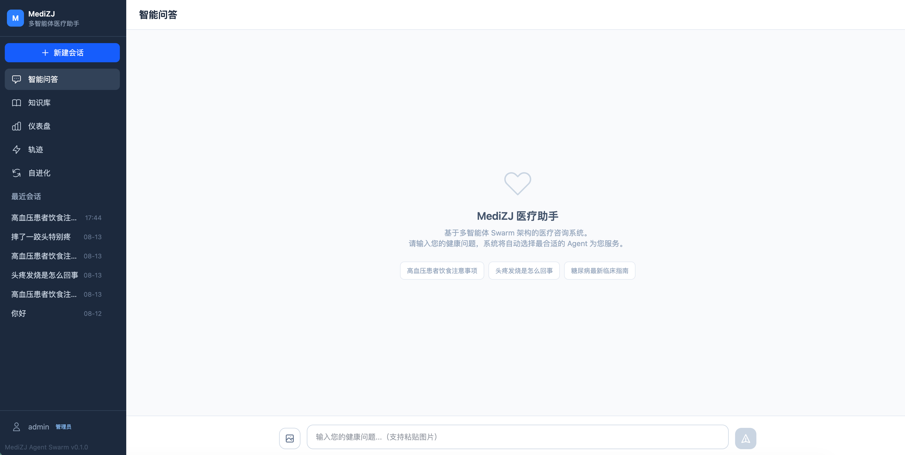

# MediZJ多智能体医疗助手

基于 Skill + Tool 双层架构的多智能体协作医疗助手系统，融合 LangGraph Agent 子图、Agent Swarm、记忆管理、Milvus 知识库和 Web 前端界面。


## 📋 项目概述

本项目采用创新的 **Skill + Tool 双层架构**，通过10个原子 Skills（能力包：指令+工具）和3个专业 Agent 协同工作，提供智能、专业的医疗服务。支持 **CLI 交互**和 **Web 界面**两种使用方式。

### 🎯 核心特性

- **🌐 Web 前端界面**: Vue 3 + FastAPI 全栈架构，支持智能问答、知识库浏览、会话管理、仪表盘 ✅
- **📡 流式响应**: 实时推送 Agent 执行过程，可视化 Agent 参与情况 ✅
- **🩺 交互式问诊**: LeadAgent 在任务分发前通过结构化问卷收集用户背景信息（症状、病史、用药等），基于 LangGraph interrupt/Command 挂起恢复，支持 **LLM 自决多轮追问**（硬上限 3 轮），实现"先问后诊" ✅
- **🔧 Skill + Tool 双层架构**: 10个原子 Skills（指令+工具）与底层 Tool 调用明确分层，activate_skill 激活后注入指令并动态加载工具 ✅
- **🤖 LangGraph Agent 子图**: LLM 驱动的 Skill 调用循环（AgentSubGraph），Worker 自主规划、调用 Skills 并完成任务 ✅
- **🤖 统一 Agent 委派**: 单 Agent 与 Swarm 共用 `AgentSubGraph` 执行机制，Worker 隔离子会话、无历史上下文，路由由 LeadAgent 评估自动决定 ✅
- **🧠 记忆系统**: 短期记忆（写时增量压缩）+ 长期记忆（Mem0）+ 个人档案（SQLite profiles 表）+ **LLM 质量门控 + 信息分类存储** ✅
- **💾 Milvus 知识库**: 统一知识管理，语义检索，支持模糊查询（"血压高" → "高血压"）；Web 界面支持文档增删改查、文件上传、chunk 查看 ✅
- **⚡ Claude Code Skills**: 10个预定义技能，一键调用医疗助手 ✅
- **🏗️ Harness Engineering**: 约束驱动 + 熵管理，系统自动验证和优化，保证安全、简洁、高质量 ✅
- **📝 Prompt 集中管理**: 所有 prompt 统一存放在 `mediZJ/prompt/` 目录，基于 Jinja2 模板引擎管理，支持变量渲染和条件分支 ✅
- **🔍 Trace 追踪**: 全链路请求追踪，六种 Span 类型（TRACE/STAGE/AGENT/ITERATION/LLM/TOOL），瀑布图可视化，per-agent/tool/llm 聚合统计 ✅
- **🚦 并发安全**: per-session 请求互斥与记忆写锁、个人档案按 user_id 隔离、LLM 全局并发限流 + 共享连接池、阻塞调用全部下线程，支持多用户同时提问 ✅
- **🔐 免密登录**: 多用户身份隔离（SQLite 随机会话令牌 + Cookie），个人档案按 user_id 隔离，非登录用户强制跳转个人中心 ✅
- **🖼️ 多模态图片**: 图片上传 → Vision 模型（VISION_* 配置）解析 OCR 文本 → 注入 Agent 子任务上下文 ✅
- **♻️ 对话自进化**: 真实对话按用户反馈/确定性采样异步评审（医疗安全七维量表），沉淀原子可复用经验（脱敏/过期/回滚控制），运行时注入 Worker 档案与任务分解 prompt，驱动系统自我改进 ✅

## 🎯 Skill + Tool 双层架构

### 架构设计

```
两层模型：
  Skill    ── 能力包（name + description + instructions 指令正文 + 声明的 tools）
  Tool     ── 底层可调用函数，属于某个 Skill

启动时：
  所有 Skill 的 name + description 写入 system prompt（LLM 启动即知可用能力）
  base tools = [activate_skill]（仅需 1 个基础工具）

运行时：
  LLM 从 system prompt 知道有哪些 Skill
  → 调用 activate_skill("search-knowledge")
  → tool result 返回该 Skill 的 instructions 指令正文
  → tools 列表更新为该 Skill 声明的工具
  → LLM 使用 Skill 的工具执行任务
  → 给出最终回答
```

### 关键特性

1. **Skill 与 Tool 分层**
   - Skill 是能力包：包含描述、指令正文（SKILL.md body）、声明的工具列表
   - Tool 是底层函数：从 Skill 的 `script/` 目录加载，仅在 Skill 激活时可用
   - `activate_skill` 是唯一的基础工具，始终可用

2. **指令注入机制**
   - SKILL.md 的 YAML frontmatter 提供 `name`、`description`、`tools` 字段
   - SKILL.md 的 Markdown 正文作为 Skill 指令，通过 `activate_skill` 的 **tool result** 返回给 LLM
   - Agent 获得 Skill 的上下文知识，而非仅获得工具

3. **动态工具加载**
   - 未激活任何 Skill 时，LLM 只有 `activate_skill` 一个工具
   - 激活 Skill 后，该 Skill 声明的工具动态加载到工具列表
   - 激活新 Skill 自动停用前一个，避免工具膨胀

4. **兼容模式自动检测**
   - 全部 10 个 Skill 都有 `tools` 声明 → 启用双层模式
   - 否则 → 兼容模式（所有工具平铺暴露，旧行为）

5. **多轮对话支持**
   - 短期记忆：会话级对话历史（retrieve 阶段取最近 10 条消息），**仅供 LeadAgent 使用**（任务分解时参考上下文）
   - **统一子会话隔离**：所有模式（单 Agent / Swarm / 降级）均通过 `AgentSubGraph` 执行 Worker，使用独立子会话 ID（`{session_id}:{agent_id}:{subtask_id}`），Worker 无历史上下文、只接收任务指令
   - 个人档案：SQLite `profiles` 表（Markdown 文本整体入库），由 SwarmCoordinator 注入 Worker.user_context，AgentSubGraph 注入为 system message
   - 长期记忆：Mem0 跨会话记忆（经 LLM 质量门控过滤），LeadAgent 筛选后嵌入子任务 description
   - **上下文利用率 100%**：追问能正确理解历史对话（LeadAgent 持有历史，分解出引用上下文的子任务）
   - **LLM 语义摘要**：写入时增量压缩，早期对话自动压缩为结构化摘要，保留关键医学信息

### SKILL.md 格式

```yaml
---
name: search-knowledge
description: 搜索医学知识库，通过语义检索查找相关医疗信息
tools:
  - search_knowledge
---

# 搜索医学知识
[正文内容作为 Skill 指令，激活时注入 system prompt]
...
```

### 数据模型

```python
@dataclass
class SkillDefinition:
    name: str                    # "deep-research"
    description: str             # YAML frontmatter description
    instructions: str            # SKILL.md body 正文
    tool_names: List[str]        # YAML tools 列表
    tool_functions: Dict[str, Callable]  # 实际加载的函数对象
    migrated: bool               # 是否有 tools 声明
```


## 🩺 交互式问诊（question_for_user）

系统在将用户问题分发给 Worker Agent 之前，由 **LeadAgent 先执行信息澄清阶段**，通过结构化问卷收集用户背景信息，实现"先问后诊"。澄清基于 **LangGraph interrupt() 打断 + Command(resume) 恢复**，图执行在问卷处挂起、用户提交答案后恢复，**checkpoint 按需引入**（仅流式路径挂载 MemorySaver）。

### 工作流程

```
用户输入: "我最近头疼"
    │
    ▼
意图识别（intent_classify 节点）
    ├─ others（寒暄/无关）→ chat_reply 闲聊直答
    └─ medical → clarify 澄清流程
            │
            ▼
clarify_decide 节点（每轮）
    ├─ 达到 3 轮硬上限？→ 汇总已收集信息，结束澄清
    ├─ LLM 判断：无需更多信息 → 结束澄清
    └─ LLM 调用 question_for_user → 构建 XML 问卷
            │
            ├─ 发射 AGENT_QUESTIONNAIRE 事件 → SSE 推送到前端
            │
            ▼
clarify_ask 节点（interrupt 挂起）←─ ─ ─ ─ ─ ─ ─ ─ ┐
            │                                          │
            ▼                                          │
前端 QuestionnaireCard 渲染                          │
  ┌──────────────────────┐                            │
  │  年龄 | 性别 | 症状    │  ← Tab 切换式             │
  │ ┌──────────────────┐ │                            │
  │ │ 症状持续了多久？   │ │                            │
  │ │ ○ 不到1天         │ │                            │
  │ │ ● 1-3天          │ │                            │
  │ │ ○ 1周左右        │ │                            │
  │ │ 其他：[____]      │ │  ← 自由输入框              │
  │ └──────────────────┘ │                            │
  │    < 上一题  ●●○  下一题 >                         │
  └──────────────────────┘                            │
    │                                                 │
    ├─ 用户填写并提交                                  │
    │                                                 │
    ├─ POST /api/chat/answer ── 答案入信号队列 ────────┘
    │                                                 │
    ▼                                                 │
Command(resume=answers) 恢复图 → clarify_ask 返回答案 ──┘（回到 clarify_decide）
    │
    ├─ LLM 判定需继续追问？→ 再次发第二份问卷（多轮，最多 3 轮）
    │
    ▼（澄清完成，携带 collected_info）
记忆检索（retrieve_memories，先澄清再检索）
    │
    ▼
LeadAgent.assess_and_decompose(问题 + collected_info)
    │
    └─ 按子任务数量路由 → Worker 执行（统一走 AgentSubGraph + 隔离子会话）
```

### 核心组件

| 组件 | 文件 | 职责 |
|------|------|------|
| **question_for_user 工具** | `mediZJ/core/tools/questionnaire.py` | XML 问卷解析 + 结构化数据构建 |
| **clarify_decide 节点** | `mediZJ/lgraph/supervisor_graph.py` | 每轮 LLM 判定是否追问，发问卷、存 pending payload（硬上限 3 轮） |
| **clarify_ask 节点** | `mediZJ/lgraph/supervisor_graph.py` | 唯一 `interrupt()` 挂起点，resume 返回用户答案 |
| **SessionRuntime** | `mediZJ/api/services/session_runtime.py` | 缓存 graph + MemorySaver，跨请求复用完成恢复 |
| **SSE 状态机** | `mediZJ/api/services/chat_service.py` | `while True + phase` 循环，支持 0/1/多次 interrupt 挂起恢复 |
| **AGENT_QUESTIONNAIRE 事件** | `mediZJ/swarm/events.py` | 向前端推送问卷（另有 AGENT_QUESTIONNAIRE_CANCELLED 取消事件） |
| **QuestionnaireCard 组件** | `frontend/src/components/chat/QuestionnaireCard.vue` | Tab 切换式问卷 UI（含提交失败错误态） |
| **答案提交端点** | `mediZJ/api/routers/chat.py` | `POST /api/chat/answer` 接收用户回答 → 入信号队列 |
| **QuestionnaireManager** | `mediZJ/core/questionnaire_manager.py` | 问卷幂等校验/清理（interrupt 恢复由 SessionRuntime 承担） |

### XML 问卷格式

```xml
<questions>
  <question header="年龄" type="input" required="true">
    <text>请问您的年龄是？</text>
  </question>
  <question header="性别" type="enum" required="true">
    <text>您的性别是？</text>
    <suggest>男</suggest>
    <suggest>女</suggest>
  </question>
  <question header="既往病史" type="multi" required="false">
    <text>您是否有以下既往病史？</text>
    <suggest>高血压</suggest>
    <suggest>糖尿病</suggest>
    <suggest>心脏病</suggest>
  </question>
</questions>
```

**题型说明**：

| type | 渲染方式 | 说明 |
|------|---------|------|
| `enum` | 单选按钮 + 其他输入框 | 单选，用户也可在"其他"框自由输入 |
| `multi` | 复选框 + 其他输入框 | 多选，"其他"内容提交时追加到已选项 |
| `input` | 文本输入框 | 自由文本，如年龄、症状描述等 |

### 关键设计

1. **仅 LeadAgent 澄清**：澄清阶段仅在 LeadAgent 层面执行，`question_for_user` 工具通过 `allowed_agents=["lead_agent"]` 权限收口，Worker Agent 不可见、不可调用
2. **interrupt 挂起/Command 恢复**：澄清基于 LangGraph `interrupt()` 打断 + `Command(resume=...)` 恢复，替代旧版 asyncio.Future 阻塞；checkpoint 按需引入（仅流式路径挂载 MemorySaver）
3. **decide/ask 双节点多轮循环**：`_clarify_decide`（LLM 判定是否追问）+ `_clarify_ask`（唯一 interrupt 挂起点）构成环，每轮 resume 只重跑 ask（无 LLM 重放）；**LLM 自决追问 + 硬上限 3 轮**，第 4 次 LLM 不会被调用
4. **SSE 状态机**：`_chat_stream_impl` 用 `while True + phase` 统一管理 0/1/多次 interrupt——挂起时等待答案、收到后 resume、可能再次挂起，resume 后正常完成则收尾（不卡死）
5. **先澄清再检索**：意图分类独立节点提前路由闲聊/澄清；记忆检索（retrieve_memories）后移到 clarify 完成后、任务分解之前
6. **上下文注入**：clarify 决策每轮注入用户档案 + 近期对话 + 历史相似案例 + 已收集答案，避免重复提问已有信息；收集的信息打包为 collected_info 注入任务分解
7. **Tab 切换 UI**：前端问卷不一次性展开，每次只显示一个问题，支持上/下一题切换和进度指示
8. **自由输入兜底**：单选/多选题底部均有"其他"输入框，避免选项遗漏用户实际情况
9. **提交失败保护**：前端仅 POST 成功才清空问卷卡片；失败保留卡片 + 错误提示，用户可重试（避免后端一直等答案、SSE 挂起导致会话卡死）


## 🚀 从零开始运行

### 1. 环境准备

需要 Python 3.10+（建议 3.12）。

```bash
conda create -n medix-swarm python=3.12 -y
conda activate medix-swarm
cd medix-agent-swarm
```

### 2. 安装依赖

```bash
# 方式 1: uv（推荐，lockfile 锁定）
uv sync

# 方式 2: pip + conda 环境
pip install -r requirements.txt  # requirements.txt 不在仓库中，需按 pyproject.toml 手动安装
```

### 3. 配置 API

复制 `.env.example` 并填入实际配置：

```bash
cp .env.example .env
```

编辑 `.env` 文件：

```env
# LLM 配置（OpenAI 兼容 API）
LLM_API_KEY=your-llm-api-key
LLM_BASE_URL=https://api.openai.com/v1
LLM_MODEL_NAME=your-model-name
LLM_TEMPERATURE=0.7
LLM_MAX_TOKENS=8192

# 并发与超时配置
LLM_MAX_CONCURRENCY=16
LLM_TIMEOUT=60
REQUEST_TIMEOUT=300

# 登录配置（免密登录，仅适用于本地或可信网络）
MEDIZJ_ADMIN_USERNAME=admin
AUTH_SESSION_DAYS=7
AUTH_COOKIE_SECURE=false

# Embedding 模型
EMBEDDING_MODEL_NAME=BAAI/bge-small-zh-v1.5

# Vision 多模态模型配置（可选，用于图片解析；未设置则回退到主 LLM）
VISION_MODEL_NAME=gpt-4o
VISION_API_KEY=
VISION_BASE_URL=
VISION_TEMPERATURE=0.3
VISION_MAX_TOKENS=2048

# AB Test Baseline 配置（同模型无包装，用于对比评估）
BASELINE_LLM_API_KEY=your_baseline_api_key_here
BASELINE_LLM_BASE_URL=https://api.openai.com/v1
BASELINE_LLM_MODEL_NAME=gpt-4o

# Mem0 长期记忆配置（可选）
MEM0_API_KEY=m0-your-api-key-here
```

### 4. 初始化知识库

首次使用前需将医学知识文档导入 Milvus 向量数据库：

```bash
# 追加导入
python mediZJ/knowledge/scripts/import_hardcoded_data.py

# 清空后重新导入
python mediZJ/knowledge/scripts/import_hardcoded_data.py --clean
```

如需批量生成更多知识文档，可执行生成脚本：

```bash
python mediZJ/knowledge/scripts/gen_part1_lifestyle_symptom.py  # 30 份生活方式 + 15 份症状识别
python mediZJ/knowledge/scripts/gen_part2_icd10.py              # 25 份 ICD-10 编码
python mediZJ/knowledge/scripts/gen_part3_guidelines.py          # 30 份临床指南
```

### 5. 运行测试

集成测试依赖真实 LLM API，默认跳过。通过 `--run-integration` 启用，需先确保 `.env` 中 `LLM_API_KEY` / `LLM_BASE_URL` 已配置。

```bash
# 单元测试（328 个，无需外部服务，秒级完成）
pytest tests/ -m "not integration"

# 集成测试（14 个，需 .env 中配置 LLM_API_KEY / LLM_BASE_URL）
pytest tests/ -m "integration" --run-integration

# 全部测试（342 个）
pytest tests/ --run-integration

# 覆盖率报告
pytest tests/ -m "not integration" --cov --cov-report=html
```

### 6. 开始使用

**方式一：Web 界面（推荐）**

```bash
# 终端 1：启动后端 API 服务
uv run python mediZJ/api_main.py

# 终端 2：启动前端开发服务器
cd frontend && npm install && npm run dev

# 浏览器访问 http://localhost:5173
# API 文档：http://localhost:8000/docs
```

**方式二：CLI 交互**

```bash
python mediZJ/main.py
```

## 📦 项目结构

```
medix-agent-swarm/
├── mediZJ/                              # 后端核心包
│   ├── main.py                          # CLI 入口
│   ├── api_main.py                      # Web 服务入口（uvicorn）
│   ├── api/                             # FastAPI 后端 API 层
│   │   ├── main.py                      # FastAPI 应用入口、CORS、路由挂载
│   │   ├── auth.py                      # 免密登录认证（SQLite 随机会话令牌 + Cookie）
│   │   ├── routers/
│   │   │   ├── chat.py                  # /api/chat 问答接口（含流式、图片上传）
│   │   │   ├── knowledge.py             # /api/knowledge 知识库检索
│   │   │   ├── sessions.py              # /api/sessions 会话管理
│   │   │   ├── dashboard.py             # /api/dashboard 仪表盘 + 健康检查
│   │   │   ├── personal.py              # /api/personal 个人健康档案
│   │   │   ├── traces.py                # /api/traces 追踪查询
│   │   │   ├── evolution.py             # /api/evolution 自进化闭环
│   │   │   └── auth.py                  # /api/auth 登录/登出/当前用户
│   │   ├── models/                      # Pydantic 请求/响应模型
│   │   ├── services/                    # 业务逻辑封装
│   │   │   ├── chat_service.py          # 流式状态机（while True + phase）
│   │   │   ├── session_runtime.py       # 会话级 graph + MemorySaver 缓存
│   │   │   ├── image_analyzer.py        # Vision 多模态图片解析
│   │   │   ├── dashboard_service.py     # 仪表盘统计
│   │   │   ├── knowledge_service.py     # 知识库服务
│   │   │   └── session_service.py       # 会话服务
│   │   └── dependencies.py             # 依赖注入
│   ├── core/                            # 核心引擎
│   │   ├── llm_client.py                # LLM 客户端（全局并发信号量 + 共享连接池）
│   │   ├── circuit_breaker.py           # 进程级熔断器（连续失败断开）
│   │   ├── stream_token_router.py       # 流式 token 路由
│   │   ├── prompt_loader.py             # Jinja2 Prompt 模板加载器
│   │   ├── skill_loader.py              # 动态加载 Skills（支持多函数加载、指令提取）
│   │   ├── skill_registry.py            # SkillParameter 参数数据模型（SkillRegistry 类已由 ToolRegistry 取代）
│   │   ├── questionnaire_manager.py     # 问卷幂等校验/清理（interrupt 恢复由 SessionRuntime 承担）
│   │   └── tools/                       # 统一基础工具目录
│   │       ├── __init__.py              # 统一导出
│   │       └── questionnaire.py         # question_for_user 工具（XML 解析 + 格式化）
│   ├── prompt/                          # Prompt 模板（Jinja2，集中管理）
│   │   ├── agents/                      # Agent 系统提示词
│   │   │   ├── consultation_system.j2
│   │   │   ├── consultation_user_input.j2
│   │   │   ├── diagnostic_system.j2
│   │   │   └── research_system.j2
│   │   ├── swarm/                       # Swarm 协调相关提示词
│   │   │   ├── lead_system.j2
│   │   │   ├── lead_clarify.j2          # LeadAgent 澄清阶段系统提示词
│   │   │   ├── lead_clarify_user.j2     # LeadAgent 澄清阶段用户提示词
│   │   │   ├── synthesis.j2
│   │   │   ├── assessment_user.j2
│   │   │   ├── timeout_fallback.j2
│   │   │   ├── chat_reply.j2            # 闲聊直答系统提示词
│   │   │   └── chat_reply_user.j2       # 闲聊直答用户提示词
│   │   ├── research/                    # 研究模块提示词
│   │   │   ├── evidence_synthesis.j2
│   │   │   └── query_planning.j2
│   │   ├── memory/                      # 记忆相关提示词
│   │   │   ├── compression_system.j2
│   │   │   ├── compression_user.j2
│   │   │   ├── quality_eval.j2          # 质量评估 + 信息分类
│   │   │   └── intent_gate.j2           # 意图识别门控
│   │   ├── lgraph/                      # LangGraph 子图控制消息
│   │   │   └── force_answer.j2          # 强制收尾
│   │   ├── evolution/                   # 自进化评审提示词
│   │   │   └── evaluate.j2              # 医疗安全七维评审量表（温度 0）
│   │   ├── validation/                  # 输出验证模板
│   │   │   ├── high_risk_warning.j2
│   │   │   └── truncation_notice.j2
│   │   └── _language_rule.j2            # 统一中文语言规则
│   ├── swarm/                           # Swarm 协调器
│   │   ├── events.py                    # 事件驱动通信（16 种事件类型，含 AGENT_QUESTIONNAIRE）
│   │   ├── intent_classifier.py         # 意图识别（medical / others，失败降级 medical）
│   │   ├── lead_agent.py                # 闲聊直答 + 澄清决策 + 任务分解 + 结果汇总
│   │   ├── shared_context.py            # 共享环境（信息素）
│   │   └── swarm_coordinator.py         # 智能路由（clarify → decompose → route）
│   ├── lgraph/                          # LangGraph 状态图（主链路）
│   │   ├── supervisor_graph.py          # SupervisorGraph：intent_classify → (chat_reply | clarify_decide ⇄ clarify_ask) → retrieve_memories → assess_decompose → route
│   │   ├── agent_subgraph.py            # AgentSubGraph：Worker Think-Act-Observe 子图
│   │   ├── stream_adapter.py            # 流式输出适配器
│   │   ├── supervisor_state.py          # 主图状态（含 clarify_rounds / clarify_pending）
│   │   ├── agent_state.py               # Worker 子图状态
│   │   ├── tool_registry.py             # 工具注册中心（allowed_agents 权限收口）
│   │   ├── tool_executor.py             # 工具执行节点（约束验证 + references 收集）
│   │   └── worker.py                    # 轻量 Worker 规格（系统提示词/用户输入格式化/后处理/Skill 工具执行）
│   ├── trace/                           # Agent 追踪系统
│   │   ├── __init__.py                  # 模块导出
│   │   ├── models.py                    # Span 数据模型（6 种类型 + 4 类属性）
│   │   ├── context.py                   # traced_span 上下文管理器（contextvars，异步安全）
│   │   ├── collector.py                 # Span 收集器（单例，内存缓冲 → flush SQLite）
│   │   ├── analysis.py                  # 聚合分析（per-agent/tool/llm 统计、慢请求、错误）
│   │   └── storage/
│   │       └── __init__.py              # SQLite 存储（traces + spans 表，树 JSON + 扁平行）
│   ├── memory/                          # 记忆管理（集成熵管理）
│   │   ├── long_term.py                 # 长期记忆（Mem0）
│   │   ├── short_term.py                # 短期记忆（单例，写时增量压缩 + 子会话隔离）
│   │   ├── personal_profile.py          # 个人健康档案（SQLite profiles 表）
│   │   ├── session_summary.py           # 会话总结
│   │   ├── session_db.py                # 会话数据库（sessions + messages 表）
│   │   ├── session_vector_store.py      # Milvus 会话向量索引
│   │   ├── entropy_manager.py           # 熵管理器（向量语义去重 + LLM 摘要 + 截断降级）
│   │   ├── embedding.py                 # 共享 embedding 工具（模型加载 + 余弦相似度）
│   │   └── scripts/                     # 初始化/迁移脚本
│   │       ├── init_session_db.py
│   │       ├── clear_all_data.py
│   │       └── migrate_profiles_to_db.py
│   ├── constraints/                     # 约束系统
│   │   ├── agent_constraints.yaml       # Agent 能力边界
│   │   ├── swarm_constraints.yaml       # Swarm 协作规则
│   │   └── validator.py                 # 约束验证器
│   ├── validation/                      # 输出验证和修复
│   │   └── auto_fixer.py                # 自动修复器
│   ├── knowledge/                       # Milvus 知识库
│   │   ├── milvus_kb.py                 # 知识库封装（CRUD + 语义搜索）
│   │   ├── entity_index.py              # 医学实体倒排索引
│   │   ├── data/documents/              # 医学知识文档
│   │   └── scripts/
│   │       ├── import_hardcoded_data.py # 批量导入文档
│   │       ├── deduplicate.py           # 数据去重脚本
│   │       ├── gen_part1_lifestyle_symptom.py  # 生成生活方式/症状文档
│   │       ├── gen_part2_icd10.py             # 生成 ICD-10 文档
│   │       └── gen_part3_guidelines.py        # 生成临床指南文档
│   ├── research/                        # DeepResearch 模块
│   │   ├── deep_research_workflow.py
│   │   ├── evidence_synthesizer.py
│   │   ├── knowledge_base.py
│   │   └── web_search.py
│   ├── eval/                            # 评估框架
│   │   ├── runner.py                    # 评估统一入口
│   │   ├── evaluators/                  # 各维度评估器
│   │   ├── data/                        # 评估数据集
│   │   └── reports/                     # 评估报告
│   └── evolution/                       # 对话自进化闭环
│       ├── service.py                   # 编排服务（反馈入队/异步评审 worker/运行时经验检索/采样分流）
│       ├── judge.py                     # ConversationJudge LLM 评审器（七维量表 + 评分封顶 + 经验脱敏）
│       ├── storage.py                   # SQLite 存储（反馈/评审/失败/经验/发布/任务 + 回滚）
│       ├── source_catalog.py            # 失败归因源码追溯目录（白名单源码片段）
│       └── config.py                    # 自进化配置（采样率/观察率/可信来源）
│
├── frontend/                            # Vue 3 前端项目
│   ├── src/
│   │   ├── views/                       # 页面：ChatView, KnowledgeView, SessionsView, DashboardView, PersonalView, TraceView, EvolutionView
│   │   ├── components/                  # 组件：agents/, chat/, layout/, trace/
│   │   ├── stores/                      # Pinia 状态管理（chat, auth, dashboard, knowledge, personal, trace）
│   │   ├── api/                         # API 调用层（auth, chat, dashboard, evolution, image, knowledge, personal, session, trace）
│   │   ├── composables/                 # useSSE (流式), useMarkdown
│   │   ├── utils/                       # eventAggregator, formatToolResult
│   │   ├── router/                      # Vue Router 配置（含免密登录守卫）
│   │   └── types/                       # TypeScript 类型定义
│   ├── vite.config.ts
│   └── package.json
│
├── tests/                               # 测试套件（pytest 现代化）
│   ├── conftest.py                      # 共享 fixtures（mock LLM、环境变量、临时目录）
│   ├── helpers.py                       # 测试辅助函数
│   ├── test_core/                       # 核心模块：llm_client, skill_registry（SkillParameter）, prompt_loader, questionnaire_manager, circuit_breaker, stream_token_router
│   ├── test_swarm/                      # Swarm：events, shared_context, intent_classifier, tool_executor, supervisor_clarify
│   ├── test_memory/                     # 记忆：short_term（含并发安全）, entropy_manager, personal_profile（用户隔离）
│   ├── test_api/                        # API 层：chat_service 并发互斥、auth 登录
│   ├── test_constraints/                # 约束验证
│   ├── test_validation/                 # 自动修复
│   ├── test_trace/                      # Trace：models, context, collector, storage
│   ├── test_evolution/                  # 自进化：judge 评审、service 采样/观察、storage 全生命周期
│   ├── test_knowledge/                  # 知识库：entity_index
│   ├── test_research/                   # 深度研究：evidence_synthesizer
│   └── test_integration/                # 集成测试（需要真实 LLM/Milvus/Mem0）
│
├── scripts/                             # 运维脚本
│   └── stress_chat.py                   # 并发压测脚本（asyncio + httpx，支持干跑模式）
│
├── .claude/skills/                      # Claude Code Skills (10个)
│   ├── search-knowledge/                # 搜索医学知识库
│   ├── assess-risk/                     # 风险评估
│   ├── analyze-symptoms/                # 症状分析
│   ├── recommend-lifestyle/             # 生活方式建议
│   ├── disease-code/                    # ICD-10疾病编码
│   ├── clinical-guideline/              # 临床指南检索
│   ├── deep-research/                   # 深度研究
│   ├── search-history/                  # 搜索会话历史（短期记忆）
│   ├── search-similar-cases/            # 搜索相似案例（长期记忆）
│   └── render-markdown-html/            # Markdown 与 HTML 互转
│
├── docs/                                # 文档
├── logs/                                # 日志
├── pyproject.toml                       # 项目配置和依赖
├── CLAUDE.md                            # Claude Code 项目指南
├── AGENTS.md                            # Agent 指南
└── .env                                 # 环境变量配置
```

**架构说明**：
- ✅ **Web + CLI 双入口**：`mediZJ/api_main.py`（Web）/ `mediZJ/main.py`（CLI）
- ✅ **统一配置**：使用项目根目录 `.env` 文件管理环境变量
- ✅ **统一 Agent 委派**：单 Agent / Swarm / 降级均走 `AgentSubGraph` + 子会话隔离，路由自动决定

## 🤖 Skills 和 Agent 清单

### 10个原子 Skills（两层架构）

**所有 Agent 共享以下 Skills**：

| Skill | 功能 | 数据源 | 特点 |
|-------|------|--------|------|
| `search_knowledge` | 搜索医学知识库 | Milvus | 语义检索 |
| `recommend_lifestyle` | 生活方式和用药建议 | Milvus | 个性化建议 |
| `assess_risk` | 风险等级评估 | 规则引擎 | 高危症状识别 |
| `analyze_symptoms` | 症状模式分析 | 规则引擎 | 多系统分析 |
| `disease_code` | ICD-10疾病编码 | Milvus | 标准编码 |
| `clinical_guideline` | 临床指南检索 | Milvus | 权威指南 |
| `deep_research` | 深度研究 | 网络搜索 | 最新进展 |
| `search_history` | 搜索会话历史 | 短期记忆 | 当前会话上下文 |
| `search_similar_cases` | 搜索相似案例 | 长期记忆 | 跨会话经验 |
| `render_markdown_html` | Markdown/HTML 互转 | 工具内置 | 文档渲染 |

### 3个专业 Worker（自主选择 Skills）

Worker 由轻量 `Worker` 规格（`mediZJ/lgraph/worker.py`）承载，三个角色通过 agent_id 区分，内部均运行 AgentSubGraph。

#### 1. consultation_agent（健康咨询）
- **能力**: 通用健康咨询和生活方式指导
- **注册 Skills**: 全部10个（自主选择合适的 Skills）
- **常用 Skills**: `search_knowledge`, `recommend_lifestyle`

#### 2. diagnostic_agent（症状诊断）
- **能力**: 症状分析、风险评估和鉴别诊断
- **注册 Skills**: 全部10个（自主选择合适的 Skills）
- **常用 Skills**: `assess_risk`, `analyze_symptoms`, `disease_code`

#### 3. research_agent（医学研究）
- **能力**: 循证医学证据和权威指南检索
- **注册 Skills**: 全部10个（自主选择合适的 Skills）
- **常用 Skills**: `clinical_guideline`, `deep_research`

### 协调 Agent

- **LeadAgent**: 闲聊直答（others 意图）+ 信息澄清 + 任务分解 + 结果汇总（独占历史上下文）
- **SwarmCoordinator**: 记忆检索 + 意图分类 + 路由分发 + 子会话合并（路由由 LeadAgent 评估自动决定）

## 🌐 Web 界面

系统提供基于 Vue 3 + FastAPI 的 Web 界面，支持以下功能模块（首访需在个人中心完成免密登录，所有请求经 Cookie 会话令牌鉴权）：

| 页面 | 功能 | 路由 |
|------|------|------|
| **智能问答** | 聊天式问答，实时展示 Agent 协作过程，Markdown 渲染 | `/chat` |
| **知识库** | 医学知识语义搜索、文档管理（增删改查）、文件上传、chunk 查看 | `/knowledge` |
| **历史会话** | 会话列表在侧边栏展示：查看/恢复、删除、新建 | 侧边栏 |
| **仪表盘** | 统计概览、Agent 使用分布、最近会话 | `/dashboard` |
| **个人中心** | 免密登录 + 查看/编辑个人健康档案（年龄、性别、病史等） | `/personal` |
| **Trace 追踪** | 请求追踪、Agent 耗时分析、LLM 调用详情、工具调用统计 | `/traces`、`/trace/:traceId` |
| **自进化** | 对话质量评审、经验流转（观察/激活/退役）、失败归因源码、发布回滚、任务重试（管理员） | `/evolution` |

### Web 架构

```
浏览器 (Vue 3 + Vite + Tailwind CSS)
   ↓ fetch + ReadableStream
Vite Dev Proxy (/api → localhost:8000)
   ↓
FastAPI (mediZJ/api_main.py)
   ↓
api/routers/chat.py → api/services/chat_service.py
   ↓ EventBridge (asyncio.Queue)
SwarmCoordinator.process()
   ↓
SharedContext.on_event_callback → 事件推送
   ↓
换行分隔 JSON 流式响应 → 前端实时渲染
```

### API 端点

| 方法 | 路径 | 功能 |
|------|------|------|
| POST | `/api/chat` | 非流式问答 |
| POST | `/api/chat/stream` | 流式问答（换行分隔 JSON） |
| POST | `/api/chat/answer` | 提交问卷答案（交互式问诊） |
| POST | `/api/chat/upload-image` | 上传图片（Vision 解析） |
| GET | `/api/chat/history/{session_id}` | 获取会话历史 |
| POST | `/api/auth/login` | 免密登录 |
| POST | `/api/auth/logout` | 登出 |
| GET | `/api/auth/me` | 当前用户 |
| POST | `/api/knowledge/search` | 知识库搜索（去重，返回完整文档） |
| GET | `/api/knowledge/types` | 知识库类型列表 |
| GET | `/api/knowledge/documents` | 文档列表 |
| GET | `/api/knowledge/documents/{doc_id}/chunks` | 查看文档分块 |
| DELETE | `/api/knowledge/documents/{doc_id}` | 删除文档 |
| POST | `/api/knowledge/upload` | 上传文件（.txt） |
| PUT | `/api/knowledge/documents/{doc_id}` | 更新文档内容 |
| GET | `/api/sessions` | 会话列表 |
| GET | `/api/sessions/{session_id}` | 会话详情 |
| DELETE | `/api/sessions/{session_id}` | 删除会话 |
| GET | `/api/dashboard/stats` | 仪表盘统计 |
| GET | `/api/health` | 健康检查 |
| GET | `/api/personal` | 获取个人健康档案 |
| PUT | `/api/personal` | 更新个人健康档案 |
| POST | `/api/personal/pending/confirm` | 确认待确认档案项 |
| POST | `/api/personal/pending/dismiss` | 忽略待确认档案项 |
| GET | `/api/personal/records` | 获取档案记录 |
| PUT | `/api/personal/records` | 更新档案记录 |
| GET | `/api/traces` | Trace 列表 |
| GET | `/api/traces/{trace_id}` | Trace 详情 |
| GET | `/api/traces/{trace_id}/spans` | Trace Span 列表 |
| GET | `/api/traces/{trace_id}/waterfall` | 瀑布图数据 |
| GET | `/api/traces/{trace_id}/stages` | 阶段数据 |
| GET | `/api/traces/stats/agents` | Agent 耗时统计 |
| GET | `/api/traces/stats/tools` | 工具调用统计 |
| GET | `/api/traces/stats/llm` | LLM 调用统计 |
| GET | `/api/traces/stats/slow` | 慢请求列表 |
| GET | `/api/traces/stats/errors` | 错误统计 |
| POST | `/api/evolution/feedback` | 提交对话反馈（like/dislike + reason_codes） |
| GET | `/api/evolution/feedback/{message_id}` | 查询消息反馈 |
| GET | `/api/evolution/overview` | 自进化总览统计（管理员） |
| GET | `/api/evolution/evaluations` | 评审列表（管理员） |
| POST | `/api/evolution/evaluations` | 手动入队评审（管理员） |
| GET | `/api/evolution/failures` | 失败任务列表（管理员） |
| GET | `/api/evolution/sources/{source_id}` | 失败归因源码片段（管理员） |
| GET | `/api/evolution/experiences` | 经验列表（管理员） |
| POST | `/api/evolution/experiences/{experience_id}/status` | 经验状态流转 observe/activate/reject/retire/reapply/delete |
| GET | `/api/evolution/releases` | 发布版本列表（管理员） |
| POST | `/api/evolution/releases/{version}/rollback` | 发布回滚（管理员） |
| GET | `/api/evolution/jobs` | 评审任务列表（管理员） |
| POST | `/api/evolution/jobs/{job_id}/retry` | 失败任务重试（管理员） |


## ⚙️ 配置说明

项目使用 `.env` 文件管理配置（基于 `python-dotenv`）。

### 配置内容

```env
# LLM 配置（OpenAI 兼容 API）
LLM_API_KEY=your_api_key_here
LLM_BASE_URL=https://api.example.com/v1
LLM_MODEL_NAME=gpt-4o
LLM_TEMPERATURE=0.7
LLM_MAX_TOKENS=8192

# 并发与超时配置
LLM_MAX_CONCURRENCY=16   # LLM 全局并发上限（信号量，保护上游 API 配额）
LLM_TIMEOUT=60           # 单次 LLM 请求超时（秒）
REQUEST_TIMEOUT=300      # 单次问答请求总超时（秒），超时返回 504

# 登录配置（免密登录，仅适用于本地或可信网络）
MEDIZJ_ADMIN_USERNAME=admin
AUTH_SESSION_DAYS=7
AUTH_COOKIE_SECURE=false

# Embedding 模型配置（HuggingFace Hub，首次加载自动下载，之后走本地缓存）
EMBEDDING_MODEL_NAME=BAAI/bge-small-zh-v1.5

# Mem0 长期记忆配置（可选，获取地址：https://app.mem0.ai）
MEM0_API_KEY=m0-your-api-key-here

# Vision 多模态模型配置（用于图片解析，可选；未设置则回退到主 LLM 配置）
VISION_MODEL_NAME=gpt-4o
VISION_API_KEY=
VISION_BASE_URL=
VISION_TEMPERATURE=0.3
VISION_MAX_TOKENS=2048

# AB Test Baseline 配置（同模型无包装，用于对比评估）
BASELINE_LLM_API_KEY=your_baseline_api_key_here
BASELINE_LLM_BASE_URL=https://api.example.com/v1
BASELINE_LLM_MODEL_NAME=gpt-4o

# 自进化闭环（对话质量评审 + 经验沉淀）
EVOLUTION_ENABLED=true                    # 自进化开关
EVOLUTION_SAMPLE_RATE=0.2                 # 无反馈回答的确定性采样率（sha256(message_id)）
EVOLUTION_OBSERVATION_RATE=0.2            # 观察期经验实验组分流率
EVOLUTION_POLL_INTERVAL=2                 # 评审 worker 轮询间隔（秒）
EVOLUTION_JUDGE_TIMEOUT=120               # 单次评审超时（秒）
EVOLUTION_MEDICAL_EXPIRY_DAYS=180         # 高危经验过期天数
EVOLUTION_GLOBAL_MIN_SUPPORT=3            # 全局经验发布所需的至少支持用户数
EVOLUTION_TRUSTED_SOURCES=临床指南数据库,ICD-10疾病编码数据库  # 可信来源白名单
EVOLUTION_TRUSTED_DOMAINS=                # 可信域名白名单（逗号分隔，可空）
```

### 记忆系统配置

本系统支持三层记忆机制：**短期记忆（会话级）**、**个人档案（SQLite 持久化）** 和 **长期记忆（Mem0 跨会话）**，通过 LLM 质量门控实现信息分类存储。

#### 短期记忆（ShortTermMemory）

**作用**：存储当前会话的对话历史，支持多轮对话上下文理解。

**配置**：
```python
# 方式1: 内存存储（默认，无需配置）
from mediZJ.memory.short_term import ShortTermMemory
memory = ShortTermMemory(storage_type="memory")

# 方式2: Redis持久化（可选）
memory = ShortTermMemory(storage_type="redis", redis_config={"host": "localhost", "port": 6379})
```

**存储方式**：
- **内存**（默认）：无需配置，保留时间 60 分钟（ttl_seconds=3600，memory/redis 均生效，周期性过期清理）
- **Redis**（可选）：通过 `redis_config` 参数传入配置，支持持久化
- 存储容量：累积消息，写入时熵驱动压缩

**智能压缩（写时增量压缩）**：

短期记忆采用"写入时压缩、读取时零开销"模式。每次 `add_message()` 写入新消息后，检查未压缩消息的熵等级，仅当满足高熵条件时触发压缩：

- **熵驱动触发**：未压缩消息满足 `total_messages > 20` 或 `duplicate_rate > 0.15` 或 `avg_message_length > 500` 时才压缩，否则跳过
- **增量压缩**：只压缩较旧的消息，保留最近 N 条不动；压缩摘要持久化到 messages 列表，下次读取直接返回
- **LLM 语义摘要**（推荐）：调用 LLM 将早期对话压缩为结构化摘要，保留关键医学信息
- **截断降级**（自动）：LLM 不可用时降级为截断模式
- **去重**：基于向量语义相似度（BAAI/bge-small-zh-v1.5）检测并移除重复消息，阈值 0.9

#### 个人档案（PersonalProfile）

**作用**：持久化患者个人信息（年龄、性别、病史、过敏史等），**按 user_id 隔离存储**。

**存储方式**：`mediZJ/memory/data/sessions.db` 的 `profiles` 表，Markdown 文本整体入库（`content` 列 = 已确认信息 + 病史，`pending` 列 = 待确认暂存区），按 `user_id` 主键隔离（未传 user_id 时默认 `default`）。旧版 `memory/profile/{user_id}/*.md` 文件在首次访问时自动迁移入库，原文件重命名为 `.bak` 保留。

**工作方式**：

- 问答请求可携带 `user_id` 字段（`/api/chat`、`/api/chat/stream`），不同用户的档案互不可见
- `/api/personal` 系列端点支持 `?user_id=` 查询参数，缺省操作 default 用户
- LLM 每轮对话自动提取个人信息，增量合并写入（读写经共享锁串行化，并发不丢更新）
- 对话开始时自动注入到 Agent 上下文（仅已确认信息，来自 `profiles` 表 `content` 列）
- 前端「个人中心」支持手动查看和编辑

**存储格式**（Markdown 文本，存于 `content` 列）：
```markdown
# 患者个人信息

- 年龄：28岁
- 性别：男性
- 过敏史：青霉素过敏
```

#### 长期记忆（Mem0）

**作用**：跨会话记忆，存储可复用的医学知识和事实。

**配置**：
```env
MEM0_API_KEY=m0-your-api-key-here  # 获取地址：https://app.mem0.ai
```

**存储方式**：
- **Mem0 云服务**：自动处理向量化和相似度搜索
- 存储范围：跨会话持久化
- 存储内容：可复用的医学事实（症状关联、治疗方案、风险评估等）

#### LLM 质量门控 + 信息分类存储

每轮对话结束后，系统调用 LLM 对对话内容进行评估和分类：

```
对话完成
  ↓
LLM 评估（mediZJ/prompt/memory/quality_eval.j2）
  ├─ 质量评分（1-10）
  ├─ 提取个人信息 → profiles 表（sessions.db）
  └─ 提取可复用事实 → Mem0
```

**评分规则**：
- score < 5：跳过 Mem0 存储（低质量闲聊等），但个人信息仍会保存
- score ≥ 5：个人信息 + 可复用事实均入库

**日志输出**（每个 turn）：
```
  [Personal] 年龄：28岁
  [Mem0] [症状与疾病的关联] 前额胀痛是紧张性头痛的典型表现
Memory gate: PASS score=9 facts=5 personal=1 session=xxx
Memory turn summary — short_term=5 msgs | personal=1 items saved | mem0=PASS
```

#### 记忆系统如何融入对话

**流程**：

```
1. 会话开始
   ↓
2. 短期记忆：直接返回当前会话历史（压缩已在写入时完成，读取零开销）→ 仅供 LeadAgent 参考
   ↓
3. 长期记忆：检索 Mem0 相似案例
   ↓
4. LeadAgent 任务分解（携带已确认档案 + 短期记忆 + 长期记忆）
   - 用户档案（`to_text()`，仅已确认信息）→ clarify + assess 阶段自动注入
   - 短期记忆 → 理解多轮对话意图
   - 长期记忆 → 基于历史案例做更好的任务分配
   - 相关记忆嵌入子任务 description → 传递给 Worker
   ↓
5. Worker Agent 执行（统一子会话隔离）
   - 所有模式（单 Agent / Swarm / 降级）均走 AgentSubGraph
   - 每个 Worker 使用独立子会话 ID（`{session_id}:{agent_id}:{subtask_id}`），历史互不干扰
   - Worker 不加载短期记忆，只接收任务指令和用户档案
   - 个人档案：由 SwarmCoordinator 注入 Worker.user_context，AgentSubGraph 注入为 system message（所有 Worker 共享）
   - 执行完毕后：最终回答合并回主会话，子会话清除
   ↓
6. 对话结束 → LLM 质量评估 + 信息分类
   ├─ 个人信息 → profiles 表
   ├─ 可复用事实 → Mem0
   └─ 短期记忆 → AgentSubGraph 执行中自动保存
```

**注意事项**：

- 未设置 `MEM0_API_KEY` 时，系统会优雅降级，仅使用短期记忆和个人档案
- 短期记忆默认使用内存存储，无需配置 Redis
- 个人档案始终可用（本地 SQLite，无外部依赖）

## 🚦 并发与压测

系统面向多用户并发提问场景做了分层优化（单机单进程、<50 并发设计目标）。

### 并发安全设计

| 层面 | 机制 | 位置 |
| ------ | ------ | ------ |
| **会话互斥** | per-session asyncio.Lock，同会话请求排队执行，防止短期记忆 / turn_index 写竞争 | `mediZJ/api/services/chat_service.py` |
| **记忆写锁** | 短期记忆 per-session 写锁，覆盖写入 + 增量压缩全过程 | `mediZJ/memory/short_term.py` |
| **档案隔离** | 个人档案按 user_id 行级隔离（profiles 表），共享 RLock 串行化读写，旧版 md 文件自动迁移入库 | `mediZJ/memory/personal_profile.py` |
| **任务认领** | SharedContext 子任务认领加锁，防止并行 Worker 重复执行 | `mediZJ/swarm/shared_context.py` |
| **阻塞下线程** | embedding 推理 / SQLite / Milvus 等同步调用统一 `asyncio.to_thread`，不阻塞事件循环 | `chat_service.py`、`session_vector_store.py` 等 |
| **连接池复用** | AsyncOpenAI 进程级共享（httpx 池复用），embedding 模型全局单例（lru_cache） | `mediZJ/core/llm_client.py`、`mediZJ/memory/embedding.py` |
| **LLM 限流** | 全局信号量（`LLM_MAX_CONCURRENCY`，默认 16），高并发排队而非触发 429 | `mediZJ/core/llm_client.py` |
| **熔断器** | 进程级共享，跨请求累计 LLM 失败（连续 5 次断开 30s） | `mediZJ/core/circuit_breaker.py` |
| **存储串行化** | Milvus Lite 客户端调用加锁（知识库 `@_serialized` 装饰器、会话向量 RLock + 原子 delete/insert） | `milvus_kb.py`、`session_vector_store.py` |
| **总超时** | 单次问答 `REQUEST_TIMEOUT`（默认 300s），超时友好返回 504 | `mediZJ/api/services/chat_service.py` |

### 压测脚本

`scripts/stress_chat.py`（asyncio + httpx，分档位并发）：

```bash
# 终端 1：启动后端
uv run python mediZJ/api_main.py

# 终端 2：干跑（打 history 端点，不消耗 LLM token）
uv run python scripts/stress_chat.py --dry-run --tiers 10,30,50

# 终端 2：正式压测（打 /api/chat，真实消耗 LLM token）
uv run python scripts/stress_chat.py --tiers 10,30,50 --timeout 400
```

每个请求使用独立 session_id（压测目标是系统吞吐，非同会话排队）。输出各档位的成功率、状态码分布、p50/p95/p99 延迟与吞吐。

> **注意**：脚本已设置 `trust_env=False` 禁用系统代理。macOS 系统代理（如 Clash）会被 httpx 读取但不识别系统 bypass 列表，localhost 请求会被代理截获返回 502。

### 压测基线（50 并发，真实 LLM）

> **注**：以下基线为历史数据。压测结果依赖上游 LLM 配额与时延，当前 README 修订时未复测，仅供参考。

| 指标 | 结果 |
| ------ | ------ |
| 成功率 | 50/50 = 100%（无 429/5xx） |
| 延迟 | p50 ≈ 187s，p95 ≈ 212s |
| 服务端 | 进程稳定，无 Traceback / database is locked |

高并发下延迟上升是 `LLM_MAX_CONCURRENCY` 信号量排队的预期表现（请求排队等待上游配额而非失败）。若上游配额充裕，可调高该值提升吞吐。

---

## 🏗️ Harness Engineering 融合

**核心理念**："人类设计约束，AI 代理执行" —— 让 AI 在明确约束下自主工作、自我修正。

### 实现的 Harness 原则

| 原则 | MediZJ 实现 | 位置 |
|------|-----------|------|
| **约束驱动** | YAML 定义 Agent 能力边界，运行时验证 Skill 调用和输出 | `mediZJ/constraints/` |
| **自动修复** | 高危症状自动添加就医警告；免责声明统一由前端在对话末尾展示 | `mediZJ/validation/` |
| **熵管理** | 记忆自动去重和压缩，防止系统膨胀（详见下方） | `mediZJ/memory/entropy_manager.py` |

### 熵管理全流程

熵管理器是系统的"垃圾回收器"，借鉴信息论中"熵"的概念，自动清理和压缩会话历史中的冗余信息，让 LLM 始终聚焦于有效内容。

#### 设计原则

- **写时增量压缩，读时直接返回**：消息写入时检查熵，满足高熵条件时压缩早期对话，压缩结果持久化到 messages 列表；读取时直接返回列表尾部，零计算开销
- **累积增长**：压缩后继续累积新消息，当新的未压缩部分再次满足高熵条件时再次压缩
- **熵驱动**：先评估信息熵，低熵时零开销跳过，高熵时按需执行去重和压缩
- **自动降级**：LLM 不可用时自动切换为截断模式，嵌入模型加载失败时直接返回原始消息

#### 增量压缩流程

`_maybe_compress_incremental()` 在每次 `add_message()` 后自动调用：

```
输入: 新消息写入 messages[]
  │
  ▼
Step 1: 提取未压缩部分        messages[_uncompressed_start:]
  │
  ▼
Step 2: 分离可压缩区间         [start, len - keep_recent) 保留最近 N 条不动
  │
  ▼
Step 3: estimate_entropy()    计算可压缩区间的多维熵指标
  │
  ├── entropy_level != "high" → 跳过（零开销）
  │
  ▼
Step 4: duplicate_rate > 0.1? → deduplicate_messages() 贪心语义去重
  │
  ▼
Step 5: _compress_older_messages()
  │     ├── LLM 语义摘要（含动态熵约束）
  │     └── 截断降级（LLM 不可用时）
  │
  ▼
Step 6: 替换原区间 + 更新 _uncompressed_start 指针
```

#### 熵评估（多指标判定）

| 指标 | 计算方式 | 高熵阈值 |
|------|----------|----------|
| `total_messages` | 消息总数 | > 20 |
| `duplicate_rate` | 两两余弦相似度 > 0.9 的对数 / 总对数 | > 15% |
| `avg_message_length` | 平均字符数 | > 500 |

**判定规则**：任一指标触发即标记为 `entropy_level = "high"`。

`duplicate_rate` 计算示例：5 条消息共有 `5×4/2 = 10` 对组合，其中 2 对的余弦相似度 > 0.9，则 `duplicate_rate = 2/10 = 20%`。

#### 语义去重

基于 `BAAI/bge-small-zh-v1.5` 嵌入模型（512 维中文向量），采用贪心策略：

- 从新到旧逐条比对，与已保留条目的余弦相似度 > 0.9 则标记为重复
- 语义相同但措辞不同的消息也能被识别（如"高血压怎么办"与"得了高血压该怎么处理"）

#### LLM 语义压缩

当 `llm_client` 可用时，调用 LLM 将早期对话压缩为 200 字以内的结构化摘要。关键设计：**熵指标驱动动态约束注入**——

| 熵特征 | 注入的 LLM 约束 |
|--------|----------------|
| `duplicate_rate > 20%` | "对话中存在大量重复内容，请高度去重，相似问题只保留一个" |
| `avg_message_length > 500` | "单条消息较长，请重点提炼核心信息" |
| `total_messages > 30` | "对话轮次较多，请高度概括，聚焦最后的关键结论" |

LLM 的 `max_tokens` 也受熵等级影响：高熵 512 tokens，普通 256 tokens。

LLM 不可用或调用失败时，自动降级为截断模式：将 user + assistant 配对，截取前 50/100 字符生成摘要。

压缩摘要以 `assistant` role 存储，兼容 `get_history()` 的消息过滤逻辑，确保 Agent 能正确接收早期对话的摘要信息。

#### 集成位置

| 集成点 | 位置 | 作用 |
|--------|------|------|
| **ShortTermMemory.add_message()** | `mediZJ/memory/short_term.py` | 写入时调用 `_maybe_compress_incremental()`，熵驱动增量压缩 |
| **ShortTermMemory.get_recent_messages()** | `mediZJ/memory/short_term.py` | 读取时直接返回 messages 列表，零压缩开销 |
| **LongTermMemory** | `mediZJ/memory/long_term.py` | 轻量使用：在 `search_similar_sessions()` 中仅调用 `deduplicate_sessions()`，无 LLM 客户端 |
| **SwarmCoordinator** | `mediZJ/swarm/swarm_coordinator.py` | 传入 LLM 客户端，使短期记忆具备 LLM 压缩能力 |

核心流程：

```
Agent 执行（AgentSubGraph）写入短期记忆
  → ShortTermMemory.add_message(session_id, "user", content)
    → messages.append(new_message)
    → _maybe_compress_incremental(history)
      → 熵检查 → 去重 + 压缩 → 更新 _uncompressed_start

  → ShortTermMemory.get_history(session_id, limit=5)
    → messages[-limit:]  # 直接返回，无压缩计算
```

### 验证

运行单元测试套件（无需外部服务）：
```bash
pytest tests/ -m "not integration"
```

## 📊 评估框架

端到端评估框架，验证 5 项核心指标是否达标。

### 评估指标

| 指标 | 目标 | 评估方法 |
|------|------|----------|
| 智能路由准确率 | ≥ 95% | 50 题标注数据集，多次运行多数投票，比对模式 + Agent 分配 |
| 知识库检索准确率 | ≥ 87% | 30 查询数据集，Precision@5 / Recall@5 / MRR / Hit Rate |
| 响应时间 | 单 Agent ≤15s, Swarm ≤30s | P50/P90/P95 统计 + 超时率 |
| 多轮对话上下文理解 | ≥ 92% | 20 组对话 68 轮，关键词命中 + LLM-as-Judge 评分 |
| 整体回答质量 | 系统 4.5 vs Baseline 3.9 | 30 题 AB 盲评，三维度（准确性/完整性/安全性）评分 |

### 运行评估

```bash
# 运行全部评估
python -m mediZJ.eval.runner --metrics all

# 单指标
python -m mediZJ.eval.runner --metrics routing
python -m mediZJ.eval.runner --metrics retrieval
python -m mediZJ.eval.runner --metrics latency
python -m mediZJ.eval.runner --metrics multiturn
python -m mediZJ.eval.runner --metrics abtest

# 多指标
python -m mediZJ.eval.runner --metrics routing,retrieval

# AB 测试评分计算（需要先填写 scores 字段）
python -m mediZJ.eval.runner --score-abtest
```

### 评估报告

运行后自动生成：
- `mediZJ/eval/reports/eval_report_{timestamp}.md` — Markdown 评估报告
- `mediZJ/eval/reports/eval_result_{timestamp}.json` — JSON 结构化结果
- `mediZJ/eval/reports/abtest_blind_review.json` — AB 盲评数据（待人工评分）

---

## 📝 Prompt 集中管理

所有 LLM prompt 统一存放在 `mediZJ/prompt/` 目录下，使用 Jinja2 模板引擎管理，实现 prompt 与代码解耦。

### 动态”卡带式” System Prompt

系统提示词采用 KV cache 友好的三层结构（基础角色 + 技能目录 → 用户档案 → Skill 指令通过 tool result 返回）。system prompt 前缀在 AgentSubGraph 中保持稳定，Skill 指令不修改 system prompt，而是通过 `activate_skill` 的工具返回值传递给 LLM。Swarm 层面，LeadAgent 与 Worker 的 Prompt 体系完全解耦。

### 设计理念

- **集中管理**: 22 个 `.j2` 模板文件按功能分 6 个子文件夹，所有 prompt 一目了然
- **Jinja2 模板**: 支持变量渲染（`{{ variable }}`）、条件分支（``）、循环（``）
- **代码解耦**: Python 代码不再包含 prompt 字符串，修改 prompt 无需改动业务逻辑
- **统一入口**: `PromptLoader` 类提供 `load()`（静态）和 `render()`（带变量）两个方法
- **统一中文语言规则**: `_language_rule.j2` 作为公共片段，所有 Agent 输出强制使用中文

### 模板目录结构

```
prompt/
├── agents/                      # Agent 系统提示词（4 个）
├── swarm/                       # Swarm 协调提示词（8 个）
├── research/                    # 研究模块提示词（2 个）
├── memory/                      # 记忆相关提示词（4 个，含 intent_gate）
├── lgraph/                      # LangGraph 子图控制消息（1 个）
├── validation/                  # 输出验证模板（2 个）
└── _language_rule.j2            # 统一中文语言规则
```

### 使用方式

```python
from mediZJ.core.prompt_loader import PromptLoader

# 加载静态模板（无变量）
system_prompt = PromptLoader.load("agents/consultation_system.j2")

# 渲染带变量的模板
user_msg = PromptLoader.render(
    "swarm/assessment_user.j2",
    question="高血压怎么办？",
    personal_profile="个人信息：\n年龄：35岁",
    recent_history=[{"role": "user", "content": "..."}],
    historical_cases=[{"summary": "...", "score": 0.95}]
)

# 带变量渲染其它模板（如质量评估）
quality_eval = PromptLoader.render(
    "memory/quality_eval.j2",
    existing_personal="年龄：28岁",
    existing_facts=[],
    current_question="头疼怎么办？",
    current_answer="建议就医..."
)
```

### 模板变量说明

| 模板 | 变量 | 说明 |
| --- | --- | --- |
| `agents/consultation_user_input.j2` | `question`, `session_id`, `context` | 用户输入格式化 |
| `swarm/synthesis.j2` | `question`, `contributions_text`, `timeout_note`, `timeout_occurred` | 多 Agent 结果综合 |
| `swarm/assessment_user.j2` | `question`, `personal_profile`, `collected_info`, `recent_history`, `historical_cases` | LeadAgent 任务评估（结构化分段） |
| `swarm/lead_clarify.j2` | —（静态） | LeadAgent 澄清系统提示词 |
| `swarm/lead_clarify_user.j2` | `question`, `context` | 澄清阶段用户输入 |
| `swarm/chat_reply.j2` | —（静态） | 闲聊直答系统提示词 |
| `swarm/chat_reply_user.j2` | `question`, `context` | 闲聊直答用户输入 |
| `research/evidence_synthesis.j2` | `query`, `web_results`, `kb_results` | 证据综合（含 for 循环） |
| `research/query_planning.j2` | `question` | 查询拆解 |
| `memory/compression_user.j2` | `dialogue_text` | 对话压缩 |
| `memory/quality_eval.j2` | `existing_personal`, `existing_facts`, `current_question`, `current_answer` | 质量评分 + 信息分类提取 |
| `memory/intent_gate.j2` | `question` | 意图识别门控 |
| `lgraph/force_answer.j2` | —（静态） | 强制收尾 |
| `validation/high_risk_warning.j2` | —（静态） | 高危症状警告 |
| `validation/truncation_notice.j2` | —（静态） | 截断提示 |
| `_language_rule.j2` | —（静态） | 统一中文语言规则 |

---

## 📚 统一知识库

- **向量数据库**: Milvus Lite（本地文件，无需服务器）
- **Embedding 模型**: BAAI/bge-small-zh-v1.5（中文，512维）
- **数据存储**: `mediZJ/knowledge/data/documents/` (txt 文档，当前 94 个)
- **初始化**: `python mediZJ/knowledge/scripts/import_hardcoded_data.py`（--clean 清空后重导）
- **文档生成**: `mediZJ/knowledge/scripts/gen_part*.py` 可批量生成新文档（生活方式/症状/ICD-10编码/临床指南）

### 知识库管理功能

Web 界面的知识库页面提供三个 Tab：

- **搜索**: 语义搜索，按 `doc_id` 去重，返回完整文档内容
- **文档管理**: 查看所有文档列表、每个文档的 chunk 详情、编辑和删除文档
- **上传文件**: 拖拽上传 `.txt` 文件，选择文档类型和元数据

### 数据去重

如因多次导入导致数据重复，运行去重脚本：

```bash
python mediZJ/knowledge/scripts/deduplicate.py
```

### 三路混合检索

知识库检索采用 **Dense + BM25 + Entity Boost** 三路融合策略，在 `MedicalKnowledgeBase.search()` 内部透明完成，所有 Skill 无需改动。

#### 检索架构

```
用户查询: "高血压怎么治疗"
     │
     ├─ Path 1: 稠密向量检索 (Dense)
     │     BAAI/bge-small-zh-v1.5 (512d)
     │     → query embedding (IP, L2 归一化)
     │     → AnnSearchRequest, limit=top_k×3
     │     → FLAT 索引，暴力精确搜索
     │
     ├─ Path 2: 内置 BM25 稀疏检索 (Sparse)
     │     原始文本字符串 → Milvus 服务端 chinese analyzer 分词
     │     → 内置 BM25 Function 自动评分
     │     → AnnSearchRequest, limit=top_k×3
     │     → SPARSE_INVERTED_INDEX, metric=BM25
     │
     └─ Path 3: 医学实体精确匹配 (Entity Boost)
           jieba 分词 → 医学实体过滤
           → 内存倒排索引 entity → Set[doc_id]
           → 查询词命中计数 → 归一化 [0,1]
```

#### 数据入库（写入侧）

写入时仅编码稠密向量，稀疏向量由 Milvus 服务端 BM25 Function 自动生成：

```
原始文档 (94 个 .txt)
  │
  ├─ 文本分块 (chunk_size=1024, overlap=100)
  │
  ├─ Dense 向量化
  │    SentenceTransformer.encode()
  │    → dense_vector (FLOAT_VECTOR, 512d)
  │
  ├─ BM25 稀疏向量（服务端自动生成）
  │    text 字段声明 analyzer_params={"type": "chinese"}
  │    → Milvus 内置 BM25 Function 自动分词 + 评分
  │
  └─ Entity Index 增量同步
       entity_index.add_document(doc_id, text)
```

**BM25 编码说明**：使用 Milvus 2.5+ 内置 BM25 Function，text 字段声明 `analyzer_params={"type": "chinese"}` 使 Milvus 服务端以 jieba 中文分词自动构建 BM25 稀疏向量。

#### 融合策略

| 阶段 | 方法 | 公式 |
|------|------|------|
| **Path 1+2 融合** | Milvus RRF (RRFRanker, k=60) | `RRF(d) = 1/(60+rank_dense) + 1/(60+rank_sparse)` |
| **RRF 归一化** | 动态最大距离归一化 | `normalized = raw_rrf / max_raw_score` |
| **Path 3 加权** | App-level Entity Boost | `bonus = entity_hit_count(d) / max_hits × 0.15` |
| **最终得分** | 上界截断 | `final_score = min(normalized + bonus, 1.0)` |
| **去重** | 按 `doc_id` 保留最高分 | 每份文档只返回最匹配的一个 chunk |

#### 完整计分公式

```
final_score(d) = min( ──────────────────────  +  ────────────────────── × 0.15 , 1.0 )
                         max_raw_score                     max_hits
                         ↑                                 ↑
                    Path 1+2 RRF 贡献               Path 3 Entity 贡献

其中:
  rank_dense  = Path 1 IP 检索排序序号
  rank_sparse = Path 2 BM25 检索排序序号
  raw_rrf = 1/(60+rank_dense) + 1/(60+rank_sparse)
  max_raw_score = 所有候选 hit 中的最大 raw_rrf 值，用于动态归一化
  entity_hit_count(d) = 查询中的医学实体在文档 d 中出现的去重种数
  max_hits = 所有文档中最高的 entity_hit_count，用于归一化到 [0,1]
```

#### 双路差异与互补

| 维度 | Path 1 (Dense) | Path 2 (BM25) | Path 3 (Entity) |
|------|---------------|---------------|-----------------|
| 编码方式 | SentenceTransformer | Milvus 内置 BM25 Function (chinese analyzer) | jieba + 倒排索引 |
| 索引结构 | FLAT 暴力搜索 | SPARSE_INVERTED_INDEX | 内存 dict[entity→Set[doc_id]] |
| 度量 | IP (归一化后=余弦) | BM25 (标准评分) | 命中计数归一化 |
| 优势 | 语义理解，同义词/近义词 | 精确关键词匹配，**IDF 自动区分高频/低频词** | 医学实体精确命中 |
| 举例 | "血压高" → 召回"高血压"文档 | "高血压" → 精确命中含"高血压"的文档 | "ACEI" → 精确命中含该药物的文档 |
| 权重贡献 | RRF 排名融合 | RRF 排名融合 | +0 ~ 0.15 边际增益 |

#### 实体倒排索引（Path 3）

`MedicalEntityIndex` 在启动时从 Milvus 全量文档中自抽取医学实体：

- **分词**: jieba 中文分词
- **过滤**: 中文字符 2-12 字、ICD 编码 (`I10`、`E11.2`)、药品后缀 (`pril`、`lol`、`pine`)、英文缩写 (`ACEI`、`CCB`、`BMI`)、剂量单位 (`10mg`、`5ml`)
- **停用词**: 过滤高频医学词（"治疗""检查""疾病""症状"等）和通用虚词，防止无区分度的词污染命中计数
- **索引**: `entity → Set[doc_id]` 内存映射
- **查询**: 用户 query 分词→实体过滤→按 doc_id 累加命中数→除以最大命中数归一化到 [0, 1]
- **更新**: 文档增删时增量同步

> **为何 Entity Index 需要额外过滤高频医学词，而 BM25 不需要？**
>
> BM25 的 IDF 机制内建高频词降权——"治疗"出现在 60+ 文档中，IDF ≈ 0.45，"高血压"出现在 4 文档中，IDF ≈ 2.97。数学公式自动区分。而 Entity Index 是简单命中计数，不过滤则"治疗"会匹配几乎所有文档，完全丧失区分度。

#### NaN/Inf 防护

`_hybrid_search()` 返回结果逐 hit 扫描，对 `distance` 字段做合法性检查：

```python
for hit in results[0]:
    dist = hit.get("distance", 0.0)
    if math.isnan(dist) or math.isinf(dist) or dist < 0:
        hit["distance"] = 0.0
```

异常兜底：`search()` 中 `try/except Exception` 捕获 hybrid_search 异常 → 记录日志 → 返回 `[]`。

### 知识库引用标注

LeadAgent 基于 RAG 结果生成最终回答时，引用的检索内容句尾自动附加可点击的引用标注 `[N]` `[N,M]`，点击后弹出浮层展示 chunk 的完整元数据与全文。

#### 后端引用链路

```
search-knowledge / clinical-guideline / deep-research
    │  返回 answer（含引用编号 [N]）+ 结构化 references 数组
    │  references: [{index, doc_id, source, disease, type, filename, score, snippet, content}]
    ▼
ToolExecutor（lgraph/tool_executor.py）
    │  工具执行后自动收集 references，按 doc_id 去重，附入 Worker 最终 result
    ▼
SwarmCoordinator
    ├─ 单Agent/降级模式 : references → citations 透传
    └─ Swarm 模式       : 跨 Worker 收集 → doc_id 去重 → 重编号 → 替换贡献文本中的旧编号
    ▼
LeadAgent.synthesize_results()
    │  synthesis.j2 指示保留引用编号，综合后最终回答含统一编号
    ▼
ChatService
    │  SSE done 事件 + JSON 事件文件 + non-stream ChatResponse 均携带 citations
    ▼
SQLite (messages.citations) / JSON 事件文件
    │  持久化引用数据，历史会话可回放
    ▼
前端 ChatMessage.citations
```

#### 前端渲染与交互

| 组件 | 文件 | 职责 |
|------|------|------|
| **useMarkdown** | `frontend/src/composables/useMarkdown.ts` | markdown 渲染后正则匹配 `[N]` `[N,M]` `[N-M]` → `<sup class="citation-ref">`，保护代码块 |
| **CitationPopover** | `frontend/src/components/chat/CitationPopover.vue` | Teleport 浮层，scroll/resize 实时跟随引用位置；外部点击关闭；固定高度滚动区展示完整 chunk 全文 |
| **ChatMessage** | `frontend/src/components/chat/ChatMessage.vue` | 绑定 citation-ref 点击事件驱动 Popover，流式更新时自动关闭 |

#### Popover 展示字段

| 字段 | 说明 |
|------|------|
| 引用编号 | `[N]`，带分数 `XX% 相关` |
| 内容全文 | 完整 chunk，`max-h-48` 固定高度滚动，`whitespace-pre-wrap` 保留换行 |
| 来源 | `source`（如"临床指南数据库""生活方式建议数据库"） |
| 疾病 | `disease` |
| 类型 | `type`（lifestyle / clinical_guideline / disease_classification 等） |
| 文件 | `filename`，溢出省略 |

#### 分数展示

三个 RAG 工具检索时均将 `score`（0-1 的相关度）透传到前端：

- **search-knowledge**：格式化输出中 `相关度: 85.00%`，LLM 可见以辅助内容可信度判断
- **clinical-guideline**：`format_guideline` 追加 `相关度: XX%`
- **deep-research**：`format_research_report` 来源列表逐条展示分数

## 🤝 技术架构

### Agent SubGraph (Think-Act-Observe)

```
┌─────────┐     ┌────────┐     ┌──────────┐
│  Think  │ ──> │  Act   │ ──> │  Observe │
└─────────┘     └────────┘     └──────────┘
     ↑                               │
     └───────────────────────────────┘
```

### Skill + Tool 双层架构流程

```
启动时：
  所有 Skill 的 name + description → system prompt（LLM 启动即知可用能力）
  base tools = [activate_skill]

运行时（KV cache 友好，system prompt 前缀不变）：
用户问题
   ↓
SwarmCoordinator
   ├─ 意图分类（intent_classify 节点）→ others 走闲聊直答；medical 走澄清
   │
   ├─ LeadAgent 澄清（clarify_decide ⇄ clarify_ask 多轮 interrupt）
   │    ├─ LLM 调用 question_for_user 发问卷 → interrupt 挂起 → Command(resume) 恢复
   │    └─ LLM 自决追问（最多 3 轮）→ 收集 completed collected_info
   │
   ├─ 记忆检索（retrieve_memories，先澄清再检索）
   │
   ├─ LeadAgent.assess_and_decompose(问题 + collected_info)  ← 注入完整上下文后分解
   │
   ├─ 按子任务数量路由（统一走 AgentSubGraph + 隔离子会话）：
   │    ├─ 0个 → 降级到 consultation_agent
   │    ├─ 1个 → 直接路由到指定 Worker
   │    └─ ≥2个 → SharedContext 分发，3个 Worker 并行认领执行（Send API Map-Reduce）
   │
   └─ LeadAgent.synthesize_results() ← 汇总结果 → 最终回答
```

### 记忆系统架构

```
┌────────────────────────────────────┐
│  短期记忆（会话级，内存/Redis）     │
│  - 对话历史（messages）            │
│  - 写时增量压缩（熵驱动）          │
│  - 保留时间：60分钟                │
│  存储：内存（默认）或 Redis        │
├────────────────────────────────────┤
│  熵管理器（写时触发）              │
│  - 向量语义去重（检测重复消息）    │
│  - LLM 语义摘要（压缩早期对话）    │
│  - 截断降级（LLM 不可用时）        │
│  → 压缩结果持久化到 messages 列表  │
└────────────────────────────────────┘
           ↕ (每轮对话后)
┌────────────────────────────────────┐
│  LLM 质量评估 + 信息分类           │
│  - 质量评分（1-10）                │
│  - 信息提取与分类                  │
│  - 去重（已有事实跳过）            │
└──────┬─────────────┬───────────────┘
       │             │
       ▼             ▼
┌─────────────┐ ┌────────────────────┐
│ 个人档案    │ │ 长期记忆（Mem0）   │
│ profiles 表 │ │ 可复用医学事实     │
│ （SQLite）  │ │ （向量数据库）     │
│ 年龄/性别/  │ │ 症状关联/治疗方案/ │
│ 病史/过敏史 │ │ 风险评估/生活建议  │
└──────┬──────┘ └─────────┬──────────┘
       │                  │
       ▼                  ▼
┌──────────────┐  ┌───────────────────┐
│ AgentSubGraph │  │ LeadAgent         │
│ 注入为       │  │ 筛选相关案例      │
│ system msg   │  │ 嵌入 description  │
│ (所有Worker) │  │ (传给 Worker)     │
│ 仅已确认信息 │  │ 仅已确认信息      │
└──────────────┘  └───────────────────┘
```
---
## 工作流

系统只有**一个统一工作流**，单 Agent 与 Swarm 的区别仅在于 LeadAgent 分解出的子任务数量不同——Worker 内部走完全相同的 `AgentSubGraph` 和隔离子会话机制。

### 统一工作流（路由决定并发度）

```plaintext
=======================================================================
        【 统一工作流：clarify → retrieve → decompose → route → synthesize 】
=======================================================================

               [ 用户原始输入 (User Input) ]
                            │
                            ▼
┌─────────────────────────────────────────────────────────────────────────┐
│ 阶段 0：意图识别 (intent_classify 节点)                                  │
│ IntentClassifier 判断意图：                                              │
│   - others（寒暄/无关）→ chat_reply 闲聊直答（内部检索近期历史）         │
│   - medical → 进入澄清流程                                               │
└─────────────────────────────────────────────────────────────────────────┘
                            │
                            ▼ (medical)
┌─────────────────────────────────────────────────────────────────────────┐
│ 阶段 1：信息澄清 (clarify_decide ⇄ clarify_ask 多轮 interrupt)          │
│ Prompt: lead_clarify.j2 + lead_clarify_user.j2                          │
│ 每轮注入: 用户档案 + 近期对话 + 历史相似案例 + 已收集答案                │
│ clarify_decide：LLM 判定是否需问卷 → 调 question_for_user 发问卷        │
│ clarify_ask：interrupt() 挂起 → SSE 推问卷 → 用户提交 →                  │
│              Command(resume) 恢复 → 回到 clarify_decide                  │
│ LLM 自决继续追问（最多 3 轮），完成后打包 collected_info                 │
└─────────────────────────────────────────────────────────────────────────┘
                            │
                            ▼ (携带 collected_info)
┌─────────────────────────────────────────────────────────────────────────┐
│ 阶段 1.5：记忆检索 (retrieve_memories，先澄清再检索)                     │
│ 统一检索三层记忆，构建增强上下文：                                       │
│   - 短期记忆：当前会话最近 10 条消息                                     │
│   - 长期记忆：Mem0 相似历史案例（最多 3 条）                             │
│   - 个人档案：profiles 表（仅已确认信息）                                │
└─────────────────────────────────────────────────────────────────────────┘
                            │
                            ▼
┌─────────────────────────────────────────────────────────────────────────┐
│ 阶段 2：评估与分解 (LeadAgent.assess_and_decompose)                     │
│ Prompt: lead_system.j2 + assessment_user.j2                             │
│ LLM 分析问题复杂度，输出 SubTask 列表，每个子任务指定 assigned_agent    │
└─────────────────────────────────────────────────────────────────────────┘
                            │
                            ▼
              [ 按子任务数量智能路由 ]
                            │
          ┌─────────────────┼─────────────────┐
          ▼                 ▼                 ▼
   0 个子任务         1 个子任务         ≥2 个子任务
   ┌─────────┐      ┌──────────┐      ┌──────────────┐
   │ 降级到   │      │ 单 Agent │      │  Swarm 模式  │
   │ consult  │      │ 直接路由 │      │ 并行协作     │
   │ Agent    │      │ 到指定   │      │              │
   │          │      │ Worker   │      │              │
   └────┬─────┘      └────┬─────┘      └──────┬───────┘
        │                 │                   │
        ▼                 ▼                   ▼
   AgentSubGraph    AgentSubGraph      ┌─────────────────────┐
   (隔离子会话)      (隔离子会话)       │ SharedContext 分发   │
        │                 │             │ 并行 AgentSubGraph │
        │                 │             │ (隔离子会话)        │
        │                 │             └──────────┬──────────┘
        │                 │                        │
        └─────────────────┴────────────────────────┘
                            │
                            ▼
┌─────────────────────────────────────────────────────────────────────────┐
│ 阶段 3：结果汇总 (LeadAgent.synthesize_results)                         │
│ Prompt: synthesis.j2                                                    │
│ 将各 Worker 的 Contributions 拼接为 Markdown，连同原始问题交给 LLM      │
│ 超时时也会用已完成的部分结果尝试合成                                    │
└─────────────────────────────────────────────────────────────────────────┘
                            │
                            ▼
                   [ 生成最终回答 ]
                            │
                            ▼
┌─────────────────────────────────────────────────────────────────────────┐
│ 收尾 (SwarmCoordinator)                                                 │
│   - 子会话合并回主会话（Worker 历史隔离 → 主会话完整 Q&A 链）           │
│   - SessionSummary 持久化（含性能指标）                                 │
│   - LLM 质量门控 → 个人信息/病史进暂存区，高质量事实入 Mem0             │
│   - Trace 数据持久化                                                    │
└─────────────────────────────────────────────────────────────────────────┘
```

### Agent SubGraph 内部机制（所有 Worker 共享）

```plaintext
=======================================================================
        【 Agent SubGraph：Prompt 拼接与循环机制（KV cache 友好）】
=======================================================================

[ 每次迭代开始：初始化 Messages (prepare_messages 节点) ]
      │
      ▼
┌──────────────────────── Role: System (KV cache 稳定前缀) ─────────────────┐
│  1. 基础设定 (Base Prompt) : Agent 子类定义的核心角色和职责               │
│  2. 技能目录 (Skills Catalog): 当前 Agent 注册的所有可用 Skills 列表      │
│     ↑ 此后永不修改，KV cache 100% 命中                                    │
└───────────────────────────────────────────────────────────────────────────┘
      │
      ▼
┌───────────────────────── Role: System (缓慢变化) ────────────────────────┐
│  3. 用户档案 (User Context): ## 用户档案 (包含用户的长期画像数据)        │
│     ↑ 同一用户不变，KV cache 高命中                                      │
└──────────────────────────────────────────────────────────────────────────┘
      │
      ▼
┌───────────────────────── Role: User (动态) ─────────────────────────────┐
│  4. 当前输入 (User Input): 用户本次提问或派发的子任务内容               │
│     （Worker 通过 AgentSubGraph 执行，隔离子会话，无历史上下文）        │
└─────────────────────────────────────────────────────────────────────────┘
      │
      ▼
(( Agent 状态循环引擎开始 - State: IN_PROGRESS )) <─────────────────────────┐
      │                                                                     │
      ▼                                                                     │
 [ 调用 LLM Client ] ─────────────┐                                         │
      │                           │                                         │
      ▼ (无工具调用)              ▼ (返回 Tool Calls)                       │
[ 生成最终内容 Content ]    [ 记录 Assistant 消息 (含 tool_calls) ]         │
      │                           │                                         │
      │                           ▼                                         │
      │                     [ 循环执行工具 (execute_tool) ]                 │
      │                           │                                         │
      │                           ├─► 若工具为 `activate_skill`:            │
      │                           │   tool result 返回 Skill 指令正文,      │
      │                           │   tools 列表动态刷新（system prompt 不变）
      │                           │                                         │
      │                           ├─► 增加 Tool Call 计数，防止无限死循环   │
      │                           │                                         │
      │                           └─► 生成 Tool 结果消息追加到对话历史 ─────┘
      ▼
[ 后处理 Post Process ]
      │
      ▼
( State: COMPLETED ) -> 返回结果
```

---

## 🔍 Trace 追踪系统

全链路请求追踪，基于类 OpenTelemetry 的 Span 模型，非侵入式嵌入 Agent 执行流程，覆盖从请求进入到最终回答的全部阶段。

### Span 层级模型

一次请求对应一棵六层 Span 树：

```text
TRACE (root)           ← 请求级，记录 session_id、mode、agents_involved、total_tokens
├── STAGE (clarify)    ← 流水线阶段（clarify / assess_decompose / synthesize）
├── AGENT              ← Agent 执行，记录 agent_id、subtask_id、iteration_count、tool_call_count
│   ├── ITERATION      ← Think-Act-Observe 循环迭代
│   │   ├── LLM        ← LLM API 调用，记录 model、token 消耗、finish_reason
│   │   └── TOOL       ← 工具执行，记录 tool_name、arguments、result_summary、success
│   └── ITERATION
│       ├── LLM
│       └── TOOL
└── AGENT
    └── ...
```

| Span 类型 | 携带属性 | 采集位置 |
|-----------|---------|---------|
| `TRACE` | `TraceAttributes`（session_id, mode, question_summary, agents_involved, total_tokens） | `SwarmCoordinator` 请求边界 |
| `STAGE` | name 区分阶段 | `SwarmCoordinator` clarify / decompose / synthesize |
| `AGENT` | `AgentAttributes`（agent_id, subtask_id, iteration_count, tool_call_count, total_tokens） | `SwarmCoordinator._execute_single_agent_traced` |
| `ITERATION` | name 标记迭代序号 | `AgentSubGraph` 每轮循环 |
| `LLM` | `LLMAttributes`（model, prompt_tokens, completion_tokens, finish_reason） | `llm_client` |
| `TOOL` | `ToolAttributes`（tool_name, arguments, result_summary, success） | AgentSubGraph 工具执行 |

### 数据采集

通过 `traced_span` 上下文管理器非侵入式采集，基于 Python `contextvars` 实现异步安全的上下文传播：

```python
# AgentSubGraph 中：每个 ITERATION 自动创建 span
with traced_span(SpanType.ITERATION, name=f"iteration_{state.iteration}"):
    # LLM 调用 → 内部自动创建 LLM span
    # 工具调用 → 内部自动创建 TOOL span
    ...

# SwarmCoordinator 中：每个阶段创建 span
with traced_span(SpanType.STAGE, name="clarify"):
    clarify_result = await self.lead_agent.clarify(...)
```

Span 退出时自动记录耗时、状态（异常时标记 ERROR），并推入 `TraceCollector` 单例。Trace 不可用时优雅降级为空操作。

### 收集与持久化

```text
traced_span.__exit__()
      │
      ▼
TraceCollector.collect(span)         ← 内存缓冲（按 trace_id 分组）
      │
      ├─► callback → EventBridge     ← 实时 SSE 推向前端（TRACE_SPAN 事件）
      │
      ▼
TraceCollector.flush(trace_id)       ← 请求结束时调用
      │
      ├─► _build_tree()              ← 由 parent_id 重建 Span 树
      └─► TraceSqliteStorage.save()  ← 写入 SQLite（复用 sessions.db）
            ├── traces 表             ← 嵌套树 JSON（tree_json）
            └── spans 表              ← 扁平行（便于 SQL 查询），FK CASCADE 关联
```

### 聚合分析

`TraceAnalyzer` 基于 spans 表提供多维统计：

| 分析维度 | 指标 |
|---------|------|
| **per-agent** | 调用次数、avg/p50/p90 延迟、成功率、avg tokens |
| **per-tool** | 调用次数、avg 延迟、成功率 |
| **LLM** | 调用次数、avg/p50/p90 延迟、avg prompt/completion tokens |
| **慢请求** | 超过阈值的 trace 列表（按耗时降序） |
| **错误** | 状态为 error 的 trace 列表 |

### 前端可视化

`/trace` 页面提供三个视图：

- **列表**：所有 trace 按时间倒序，展示 session、模式、耗时、Agent 参与、token 消耗
- **统计**：per-agent / per-tool / LLM 统计卡片 + 慢请求 + 错误列表
- **瀑布图**：选中单个 trace 后，按时间线展示各 Span 的层级、偏移量和耗时，点击 Span 可查看完整属性

---

## ♻️ 自进化闭环

系统基于**真实对话**持续自我改进：按用户反馈或确定性采样，将回答交给 LLM 评审器按**医疗安全量表**评分，从中提取**原子可复用经验**，经观察验证后注入后续问答的 Worker 档案与任务分解 prompt。

### 闭环流程

```text
用户反馈（like/dislike + reason_codes）/ 确定性采样（sha256(message_id) < sample_rate）
      │
      ▼
EvolutionService.submit_feedback / maybe_enqueue_sample → SQLite 任务队列
      │
      ▼
后台评审 worker（startup 启动，不阻塞主对话）→ ConversationJudge.evaluate()
      ├─► 七维量表评分 → overall_score（加权，关键缺陷封顶）
      ├─► verdict: high / medium / low
      ├─► attribution 归因（prompt / retrieval / tool_call / routing / memory_profile / synthesis / other）
      └─► recommendations + 原子经验（最多 3 条）
      │
      ▼
下次问答：按词项覆盖度匹配活跃经验 → verified_experiences
      ├─► 注入 Worker 档案（_refresh_worker_profiles）与 assessment_user.j2
      └─► 观察期经验按实验组/对照组分流（EVOLUTION_OBSERVATION_RATE）
```

### 七维评审量表

| 维度 | 权重 | 说明 |
| ------ | ------ | ------ |
| `medical_safety` | 0.30 | 医疗安全（关键：< 4 分直接判 low 并封顶 59 分） |
| `accuracy_evidence` | 0.20 | 准确性 / 循证支持 |
| `completeness` | 0.15 | 回答完整性 |
| `tool_use` | 0.10 | 工具使用合理性 |
| `routing` | 0.10 | 意图识别与路由 |
| `personalization` | 0.10 | 个性化程度 |
| `clarity` | 0.05 | 表达清晰度 |

**安全封顶规则**（防止加权平均掩盖关键缺陷）：

- 安全违规 或 medical_safety < 4 → 总分 ≤ 59，判 `low`
- 数值型医学结论（摄入量/剂量/阈值）无权威来源 → 总分 ≤ 79
- 需个性化但未个性化 → 总分 ≤ 84
- 宣称基于权威资料但调用链/引用不支持 → 总分 ≤ 59
- 用户点踩（dislike）→ 直接判 `low`

### 经验生命周期

经验是**单一、原子化的行为策略**（不得沉淀疾病事实、诊断标准、药物剂量等医学知识）：

| 维度 | 规则 |
| ------ | ------ |
| **类型** | `response_strategy` / `prompt_guidance` / `routing_rule` / `retrieval_hint` / `context_strategy` |
| **范围** | `global`（脱敏后复用）/ `private`（含个人信息仅本人可见） |
| **风险** | low / medium / high；high 经验设置过期时间（默认 180 天） |
| **状态流转** | `draft → observing → active`（观察验证）/ `reject` / `retire` / `reapply` / `delete` |
| **发布** | 按版本发布，支持回滚（含阻塞校验，避免回滚破坏患者数据一致性） |

**脱敏**：全局经验自动移除 user_id、手机号、证件号、"姓名：xxx"等身份标识；含个人数据的经验强制降级为 private。

**失败溯源**：归因结果通过 `source_catalog.py` 映射到白名单源码位置（label / path / symbol / line），管理端可查看上下文片段定位问题。

### 运行时注入

- `chat_service`：问答前调用 `get_runtime_context()` 检索匹配经验，注入运行时 context；持久化后记录经验暴露 + 按采样率入队
- `supervisor_graph` / `swarm_coordinator`：`verified_experiences` 注入 Worker 档案与 `assessment_user.j2`（"仅在与当前问题匹配且不违反医学安全要求时使用"）
- `trace`：`TraceAttributes` 携带 `applied_experience_ids` / `experience_assignments`，会话删除时在同一 SQLite 事务内联动清理自进化数据

### 管理页面与配置

`/evolution` 页面（仅管理员）提供：总览统计、评审列表、失败列表、经验流转、发布回滚、任务重试，以及失败归因的源码片段查看。

```env
EVOLUTION_ENABLED=true
EVOLUTION_SAMPLE_RATE=0.2
EVOLUTION_OBSERVATION_RATE=0.2
EVOLUTION_POLL_INTERVAL=2
EVOLUTION_JUDGE_TIMEOUT=120
EVOLUTION_MEDICAL_EXPIRY_DAYS=180
EVOLUTION_GLOBAL_MIN_SUPPORT=3
EVOLUTION_TRUSTED_SOURCES=临床指南数据库,ICD-10疾病编码数据库
EVOLUTION_TRUSTED_DOMAINS=
```

---

## ⚠️ 免责声明

本系统仅供学习和研究使用，不能替代专业医生的诊断和治疗。所有医疗建议仅供参考，如有健康问题请及时就医。

## 📄 许可证

MIT License

## 🙏 致谢

- 使用 [LLM API](https://www.volcengine.com/) 作为LLM后端
- 记忆管理基于 [Mem0](https://mem0.ai/)

---
